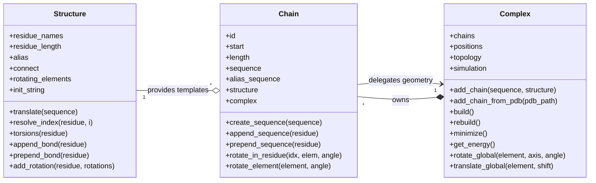
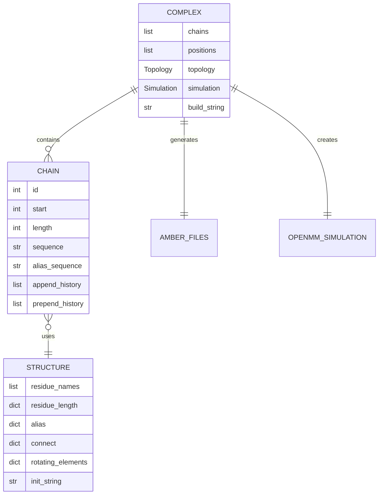
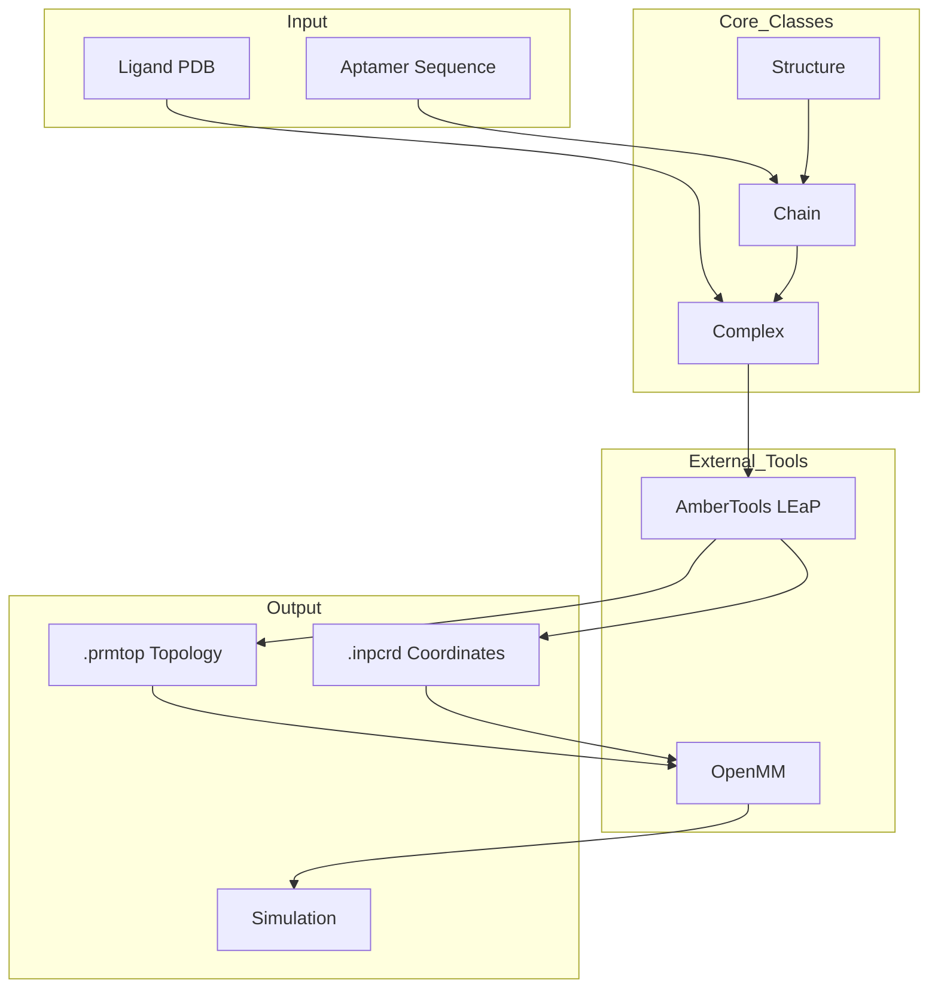

# MAWS Core Architecture

This document provides a comprehensive overview of the MAWS (Making Aptamers With Software) core data structures and their relationships.

## Overview

MAWS uses three primary abstract data types (ADTs) that work together to manage aptamer design:



## Relationship Diagram



## Data Flow



---

## Class Details

### Structure

**Purpose**: Static chemistry definitions - residue templates and topology rules.

**Role**: Provides the "vocabulary" that Chain uses to translate human-readable sequences into canonical LEaP residue names.

| Attribute           | Type                       | Description                                           |
| ------------------- | -------------------------- | ----------------------------------------------------- |
| `residue_names`     | `list[str]`                | Ordered template names (e.g., `["A", "C", "G", "U"]`) |
| `residue_length`    | `dict[str, int]`           | Atom count per residue                                |
| `alias`             | `dict[str, list[str]]`     | Maps alias → `[alone, start, middle, end]`            |
| `connect`           | `dict[str, ConnectEntry]`  | Polymer connectivity rules                            |
| `rotating_elements` | `dict[str, RotListStored]` | Torsion definitions                                   |
| `init_string`       | `str`                      | LEaP bootstrap commands                               |

| Method                             | Description                                    |
| ---------------------------------- | ---------------------------------------------- |
| `translate(sequence)`              | Convert alias sequence to canonical LEaP names |
| `resolve_index(residue, i)`        | Normalize negative atom indices                |
| `torsions(residue)`                | Get rotation triples for a residue             |
| `append_bond(residue)`             | Get connection info for appending              |
| `prepend_bond(residue)`            | Get connection info for prepending             |
| `add_rotation(residue, rotations)` | Add torsion definitions                        |

---

### Chain

**Purpose**: Lightweight view into a Complex's coordinate array.

**Role**: Manages sequence state and provides chain-local rotation methods. Does NOT own coordinates - delegates geometry to Complex.

| Attribute         | Type        | Description                          |
| ----------------- | ----------- | ------------------------------------ |
| `id`              | `int`       | Chain index within Complex           |
| `start`           | `int`       | Global atom index where chain begins |
| `length`          | `int`       | Total atoms in this chain            |
| `sequence`        | `str`       | Canonical residue names (for LEaP)   |
| `alias_sequence`  | `str`       | Human-readable alias tokens          |
| `structure`       | `Structure` | Residue templates                    |
| `complex`         | `Complex`   | Back-reference to owner              |
| `append_history`  | `list[str]` | Residues appended in last edit       |
| `prepend_history` | `list[str]` | Residues prepended in last edit      |

| Method                                             | Description                             |
| -------------------------------------------------- | --------------------------------------- |
| `create_sequence(sequence)`                        | Set entire chain sequence               |
| `append_sequence(residue)`                         | Append residue to 3′ end                |
| `prepend_sequence(residue)`                        | Prepend residue to 5′ end               |
| `rotate_in_residue(idx, elem_idx, angle)`          | Rotate torsion in specific residue      |
| `rotate_element(element, angle)`                   | Rotate chain-local element              |
| `rotate_historic_element(element, angle)`          | Rotate using pre-edit indices           |
| `rotate_in_historic_residue(idx, elem_idx, angle)` | Rotate using pre-prepend indices        |
| `update_chains()`                                  | Recompute offsets after sequence change |

---

### Complex

**Purpose**: High-level container that owns all coordinates and simulation state.

**Role**: Composes Chain objects, builds AMBER topology using LEaP, and creates OpenMM simulation for energy calculations and MD.

| Attribute      | Type          | Description                       |
| -------------- | ------------- | --------------------------------- |
| `chains`       | `list[Chain]` | All chains in insertion order     |
| `positions`    | `list[Vec3]`  | Flat coordinate array (all atoms) |
| `topology`     | `Topology`    | OpenMM topology                   |
| `system`       | `System`      | OpenMM system                     |
| `simulation`   | `Simulation`  | OpenMM simulation object          |
| `build_string` | `str`         | LEaP force field preamble         |

| Method                                | Description                                     |
| ------------------------------------- | ----------------------------------------------- |
| `add_chain(sequence, structure)`      | Add chain with Structure                        |
| `add_chain_from_pdb(pdb_path, ...)`   | Add ligand from PDB                             |
| `get_chain(index)`                    | Get chain by index                              |
| `aptamer_chain()`                     | Get chain[0] (aptamer)                          |
| `ligand_chain()`                      | Get chain[1] (ligand)                           |
| `build()`                             | Materialize topology/coordinates via LEaP       |
| `rebuild()`                           | Rebuild after sequence edits (preserves coords) |
| `rotate_element(element, angle)`      | Rotate global atom element                      |
| `rotate_global(element, axis, angle)` | Rodrigues rotation                              |
| `translate_global(element, shift)`    | Translate element by vector                     |
| `get_energy()`                        | Compute potential energy                        |
| `minimize(max_iterations)`            | Energy minimization                             |
| `step(n)`                             | Run MD for n steps                              |
| `rigid_minimize()`                    | Experimental torsion search                     |
| `pert_min(size, iterations)`          | Kick-and-minimize heuristic                     |

---

## Typical Workflow

```python
from maws.complex import Complex
from maws.rna_structure import load_rna_structure

# 1. Create Complex with force fields
cpx = Complex(
    force_field_aptamer="leaprc.RNA.OL3",
    force_field_ligand="leaprc.protein.ff19SB",
)

# 2. Add aptamer chain (empty initially)
rna = load_rna_structure()
cpx.add_chain("", rna)

# 3. Add ligand from PDB
cpx.add_chain_from_pdb(
    pdb_path="ligand.pdb",
    force_field_aptamer="leaprc.RNA.OL3",
    force_field_ligand="leaprc.protein.ff19SB",
    parameterized=True,  # For proteins
)

# 4. Set aptamer sequence and build
aptamer = cpx.aptamer_chain()
aptamer.create_sequence("G A U C")
cpx.build()

# 5. Sample conformations
import maws.space as space
cube = space.Cube(20.0, center)

for _ in range(1000):
    sample = cube.generator()
    cpx.translate_global(aptamer.element, sample[:3])
    cpx.rotate_global(aptamer.element, sample[3:6], sample[6])

    for i in range(4):
        aptamer.rotate_in_residue(0, i, random_angle)

    cpx.minimize()
    energy = cpx.get_energy()

    cpx.rebuild()  # Reset for next sample
```

---

## Coordinate Model

All atoms from all chains are stored in a single flat list:

```
positions = [atom0, atom1, atom2, ..., atomN]
            |------ Chain 0 ------|------ Chain 1 ------|
            ^                     ^
            chain0.start=0        chain1.start=chain0.length
```

Each chain tracks its slice via:

- `start`: Index where chain begins
- `length`: Number of atoms in chain
- `element`: Triple `[start, start+1, start+length]` for whole-chain transforms

---

## Caching

Builds are content-addressed and cached under `.maws_cache/`:

```
.maws_cache/
├── <sha1>.prmtop
└── <sha1>.inpcrd
```

Cache keys are computed from:

- `build_string` (force field sources)
- Each chain's `structure.init_string`
- Each chain's canonical sequence

Identical inputs reuse cached files, avoiding redundant LEaP runs.
