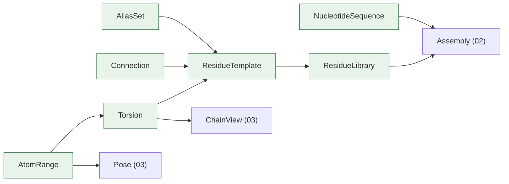

# 01 — Layer 0: Value Types

**Do:** add `maws/values.py` with 6 frozen dataclasses. Nothing imports it yet.
**Time:** about 1 day, plus half a day for tests.
**Risk:** low. Purely additive.
**Replaces:** the `[start, bond, end]` list, and the data half of
[`structure.py`](../../maws/structure.py) (411 lines).
**Imports:** `dataclasses` and `numpy`. Nothing else.

---

## 1. The `element` list

### What it is now

A bare 3-item `list`. It is the most-used shape in the package. Its meaning
changes at every hop:

| Where | Frame | Negatives? | `end=None` means | `reverse` done by |
| --- | --- | --- | --- | --- |
| [structure.py:120](../../maws/structure.py#L120) | residue-local | yes | to end of chain | — |
| [chain.py:260](../../maws/chain.py#L260) | chain-local | no | to end of chain | set `element[2]` to `0` or `element[1]` |
| [complex.py:691](../../maws/complex.py#L691) | global | no | n/a | swap slots 1 and 2 if `element[2] <= element[0]` |
| [complex.py:726](../../maws/complex.py#L726) | global | no | n/a | take pivot from `element[2]` not `element[0]` |
| [chain.py:86](../../maws/chain.py#L86) | global | no | — | middle slot is unused |

That last row: `Chain.element` is built as

```python
self.element = [self.start, self.start + 1, self.start + self.length]
```

`start + 1` is not a bond. It is filler to make the list 3 long. In
`translate_global` ([complex.py:840](../../maws/complex.py#L840)) only slots 0 and
2 are read.

### What goes wrong

`Complex.rotate_element` re-reads its own argument mid-function:

```python
# complex.py:719-723
vec_a = pos[revised_element[1]] - pos[revised_element[0]]
if revised_element[2] <= revised_element[0]:      # "end is before start"?
    revised_element_1 = revised_element[1]        # then it was not an end —
    revised_element[1] = revised_element[2]       # it was a reversed range.
    revised_element[2] = revised_element_1        # swap.
```

The axis is computed before the swap. The range is used after. So a "reversed"
element rotates a different set of atoms about the same axis. Nothing records
whether that is intended. A caller cannot tell which reading they will get without
opening this function.

### What to build

Two types, because there are two ideas:

```python
# maws/values.py

@dataclass(frozen=True, slots=True)
class AtomRange:
    """A run of atom indices, [start, stop)."""

    start: int
    stop: int

    def __post_init__(self) -> None:
        if self.stop < self.start:
            raise ValueError(f"empty or inverted range: [{self.start}, {self.stop})")

    def __len__(self) -> int:
        return self.stop - self.start

    def shifted(self, offset: int) -> AtomRange:
        return AtomRange(self.start + offset, self.stop + offset)

    def as_slice(self) -> slice:
        return slice(self.start, self.stop)


@dataclass(frozen=True, slots=True)
class Torsion:
    """A rotatable bond. `moving` rotates about the pivot-to-bond axis.

    All three fields use the same frame. Which frame is guaranteed by
    whatever produced the Torsion, never guessed by whoever reads it.
    """

    pivot: int      # axis tail atom
    bond: int       # axis head atom
    moving: AtomRange

    def shifted(self, offset: int) -> Torsion:
        return Torsion(
            pivot=self.pivot + offset,
            bond=self.bond + offset,
            moving=self.moving.shifted(offset),
        )
```

`as_slice()` returns a `slice`, not the `AtomRange` itself, because `xyz[slice]`
gives a numpy view while `xyz[anything_iterable]` triggers fancy indexing and
copies. On a path that runs 2.3 million times per run, that matters. See
[08-patterns.md](08-patterns.md#3-why-atomrange-and-not-range).

What goes away:

- `end=None`. `moving.stop` is always a real number.
- Negative indices. Resolved once, when the template loads.
- The `reverse=` flag. See below.
- The unused middle slot. Whole-chain moves take an `AtomRange`, which has no bond.
- The hidden swap in `Complex.rotate_element`. There is nothing to swap.

### `reverse` becomes a second Torsion

`reverse=True` means "rotate everything except the selected range." That is not a
flag. It is a different range. Work it out once, when the template loads:

```python
def _resolve(spec: RotationSpec, n_atoms: int, chain_len: int) -> tuple[Torsion, Torsion]:
    """Return (forward, reverse) torsions for one template rotation spec."""
    start, bond, end = spec
    start = start + n_atoms if start < 0 else start
    bond = bond + n_atoms if bond < 0 else bond
    end = chain_len if end is None else (end + n_atoms if end < 0 else end)

    forward = Torsion(pivot=start, bond=bond, moving=AtomRange(bond, end))
    reverse = Torsion(pivot=bond, bond=start, moving=AtomRange(0, start))
    return forward, reverse
```

Callers pick a torsion instead of passing a flag:

```python
# now
aptamer.rotate_in_residue(0, j, angle, reverse=True)

# proposed
pose = pose.rotate(aptamer.residue(0).torsion(j, direction="5prime"), angle)
```

`direction` is `Literal["3prime", "5prime"]`. That reads as chemistry. A boolean
does not.

---

## 2. The bug this makes impossible

> This is a reading of the code. I have not run it. Question 1 in
> [README.md](README.md#3-questions-for-you).

[chain.py:341-372](../../maws/chain.py#L341-L372) — the rotate call sits inside
the loop that fixes the indices:

```python
element = self.structure.rotating_elements[
    self.sequence_array[revised_residue_index]
][residue_element_index]                          # live ref into the template

# Normalize possibly negative indices within the residue
for i in range(len(element)):                     # len is 3, so 3 passes
    if element[i] and element[i] < 0:
        element[i] += self.structure.residue_length[...]   # edits the template

    if element[2] is None:
        revised_element = [...]
    elif element[2] == 0:
        revised_element = [...]
    else:
        revised_element = [...]
        rev = False

    self.rotate_element(revised_element, angle, reverse=rev)   # INSIDE the loop
```

Three results:

1. **Each torsion is applied 3 times per call.** The loop body runs once per index
   slot, and each pass rotates.
2. **The first 2 passes use half-fixed indices.** On pass 0 only `element[0]` is
   fixed. `element[1]` and `element[2]` may still be negative. A negative index
   into positions wraps to the far end of the complex, which is a different chain.
3. **The template is permanently changed.** `element` points into
   `Structure.rotating_elements`. After the first call the negatives are gone for
   every `Chain` sharing that `Structure`.

This runs `chunk_size × 4 nucleotides × 2 directions × n_nucleotides` times per
run. At defaults that is roughly 2.3 million calls.

None of the three is possible with the new types. `Torsion` is frozen. Its indices
are already absolute. `Pose.rotate` takes one `Torsion` and applies it once.

**Fix this first, in its own PR, with a test.** Otherwise you cannot tell whether
a changed result came from the bug fix or the redesign. See
[07-migration.md](07-migration.md#step-1-fix-rotate_in_residue-first-and-alone).

---

## 3. Residue templates

### What it is now

`Structure.__init__` takes 7 parallel lists that must line up by hand
([structure.py:54-63](../../maws/structure.py#L54-L63)):

```python
Structure(
    residue_names,         # ["GN", "AN", "UN", ...]            16 entries
    residue_length,        # [33, 32, 29, ...]                  16 entries, positional
    rotating_elements=..., # [("GN", 0, 1, None), ...]          64 entries, keyed by name
    backbone_elements=..., # [("GN", 0, 8, 10, 25, 32), ...]    16 entries, keyed by name
    connect=...,           # [[[0,-1],[-2,0],1.6,1.6], ...]     16 entries, positional
    residue_path=...,
    alias=...,             # [["CN","CN","C5","C","C3"], ...]   16 entries, keyed by name
)
```

Three are keyed by name. Two are positional. Add a residue to `RESIDUE_NAMES` but
not `RESIDUE_LENGTH` and you get an `IndexError` somewhere unrelated. Put one in
`CONNECT` at the wrong position and you get no error at all, just wrong
connectivity.

The alias table has a case worth a look. Two rows in
[rna_structure.py:158-175](../../maws/rna_structure.py#L158-L175):

```python
["CN", "CN", "C5", "C", "C3"],     # row 0
["C",  "CN", "C5", "C", "C3"],     # row 2 — same mapping, different key
```

Deliberate aliasing or copy-paste? The parallel-array format makes it hard to see.
Grouping by residue makes it obvious.

### What to build

```python
@dataclass(frozen=True, slots=True)
class Connection:
    """How this residue bonds to a neighbour on one side."""

    own_atom: int         # atom in THIS residue
    other_atom: int       # atom in the NEIGHBOUR (may be negative = from end)
    length: float         # bond length, Å


@dataclass(frozen=True, slots=True)
class AliasSet:
    """Canonical names for one alias token, by position in the chain."""

    alone: str
    start: str
    middle: str
    end: str


@dataclass(frozen=True, slots=True)
class ResidueTemplate:
    """Everything about one residue type. Self-contained. Checked on build."""

    name: str
    n_atoms: int
    torsions: tuple[Torsion, ...]          # residue-local, absolute, no sentinels
    reverse_torsions: tuple[Torsion, ...]
    head: Connection                       # 5' side
    tail: Connection                       # 3' side
    aliases: AliasSet

    def __post_init__(self) -> None:
        for t in self.torsions:
            if not (0 <= t.pivot < self.n_atoms and 0 <= t.bond < self.n_atoms):
                raise ValueError(
                    f"{self.name}: torsion {t} points outside [0, {self.n_atoms})"
                )
```

The parallel lists become one dict, checked once when it loads:

```python
class ResidueLibrary(Mapping[str, ResidueTemplate]):
    """An immutable, checked set of residue templates."""

    @classmethod
    def rna(cls) -> ResidueLibrary: ...
    @classmethod
    def dna(cls) -> ResidueLibrary: ...
    @classmethod
    def from_tables(cls, names, lengths, rotations, backbone, connect, aliases): ...
```

`from_tables` accepts today's format from
[`rna_structure.py`](../../maws/rna_structure.py) and
[`dna_structure.py`](../../maws/dna_structure.py) unchanged. Those two files need
no edits in the first step.

It gives a clear error instead of an `IndexError` from inside a loop:

```python
>>> ResidueLibrary.from_tables(
...     names=["G", "A", "U"],
...     lengths=[34, 33],              # one short
...     rotations=[], backbone=[], connect=[], aliases=[],
... )
ValueError: residue table misaligned: 3 names but 2 lengths.
            First mismatch at index 2.
```

Today that input builds fine and fails later, during a LEaP run, with a message
about a missing parameter.

---

## 4. Sequences

### What it is now

Sequences are space-separated strings, split and rejoined in 5 places:

```python
# chain.py:100
self.sequence_array = self.sequence.split(" ")
# chain.py:187
alias_sequence_array = sequence.split(" ")
# chain.py:225
self.create_sequence(" ".join(self.alias_sequence_array[:] + [sequence]))
# chain.py:252
self.create_sequence(" ".join([sequence] + self.alias_sequence_array[:]))
# structure.py:246
sequence_array = sequence.split()            # split() here, split(" ") above
```

`Structure.translate` uses `.split()`. `Chain` uses `.split(" ")`. On input with a
double space they disagree: `split()` collapses runs, `split(" ")` produces an
empty token that then fails a dict lookup.

`Chain` also keeps 4 copies of the same thing in sync by hand: `sequence`,
`sequence_array`, `alias_sequence`, `alias_sequence_array`.

### What to build

```python
@dataclass(frozen=True, slots=True)
class NucleotideSequence:
    """An aptamer sequence as alias tokens. Grows by returning a new one."""

    tokens: tuple[str, ...]

    @classmethod
    def parse(cls, text: str) -> NucleotideSequence:
        return cls(tuple(text.split()))       # one parsing rule, in one place

    def appended(self, token: str) -> NucleotideSequence:
        return NucleotideSequence(self.tokens + (token,))

    def prepended(self, token: str) -> NucleotideSequence:
        return NucleotideSequence((token,) + self.tokens)

    def canonical(self, lib: ResidueLibrary) -> tuple[str, ...]:
        """Resolve aliases to LEaP names using position rules."""
        if len(self.tokens) == 1:
            return (lib[self.tokens[0]].aliases.alone,)
        return (
            lib[self.tokens[0]].aliases.start,
            *(lib[t].aliases.middle for t in self.tokens[1:-1]),
            lib[self.tokens[-1]].aliases.end,
        )

    def __str__(self) -> str:
        return " ".join(self.tokens)
```

4 fields kept in sync become 1. `canonical()` is worked out on demand instead of
stored. The `split()` vs `split(" ")` split cannot come back: there is one parser.

---

## 5. How Layer 0 connects up



No arrows point back down into Layer 0. Nothing here imports OpenMM, touches
files, or knows `Complex` exists. So it tests with plain `pytest` and no conda
environment. Most assertions in
[`tests/test_structure.py`](../../tests/test_structure.py) move across nearly
unchanged.

**Next:** [02-topology.md](02-topology.md).
</content>
