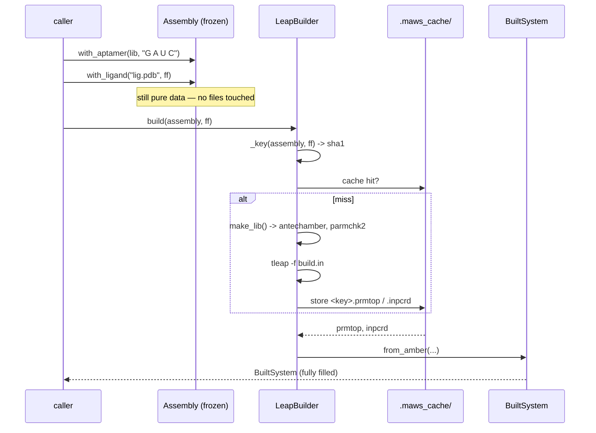

# 02 — Layer 1: Topology & Build

**Do:** add `maws/forcefield.py`, `maws/topology.py`, `maws/build.py`.
**Time:** about 2 days.
**Risk:** medium. Moves the LEaP cache.
**Replaces:** the file-reading half of [`structure.py`](../../maws/structure.py),
plus `Complex.add_chain*`, `build`, `_build_cache_key`, `_chain_lib_digests`
(about 200 lines of [`complex.py`](../../maws/complex.py)).
**Owns:** every file read, file write, and subprocess call in the package.

---

## 1. Force fields as one value

### What it is now

The force field choice is written out twice, the same way, in two files:

```python
# run.py:164-172                              # maws2023.py:213-223
if self.molecule_type == "protein":           if MOLECULE_TYPE == "protein":
    force_field_ligand = "leaprc.protein.ff19SB"    force_field_ligand = "leaprc.protein.ff19SB"
    parameterized = True                            parameterized = True
elif self.molecule_type == "organic":         elif MOLECULE_TYPE == "organic":
    force_field_ligand = "leaprc.gaff2"             force_field_ligand = "leaprc.gaff2"
    parameterized = False                           parameterized = False
else:                                         else:
    force_field_ligand = "leaprc.lipid21"           force_field_ligand = "leaprc.lipid21"
    parameterized = False                           parameterized = False
```

The pair is then passed to 4 call sites per run, because `Complex.__init__` and
`add_chain_from_pdb` each want their own copy
([run.py:183-207](../../maws/run.py#L183-L207)):

```python
cpx = Complex(force_field_aptamer=..., force_field_ligand=..., salt_conc=...)
cpx.add_chain_from_pdb(pdb_path=..., force_field_aptamer=..., force_field_ligand=..., ...)

ligand_only = Complex(force_field_aptamer=..., force_field_ligand=..., salt_conc=...)
ligand_only.add_chain_from_pdb(pdb_path=..., force_field_aptamer=..., force_field_ligand=..., ...)
```

Nothing checks the copies agree. Pass a different `force_field_ligand` to
`add_chain_from_pdb` than to `Complex` and it is accepted. You get a system
parameterised under one force field and simulated under another.

### What to build

```python
# maws/forcefield.py

@dataclass(frozen=True, slots=True)
class ForceField:
    """The full force field setup for one run."""

    aptamer_source: str          # "leaprc.RNA.OL3"
    ligand_source: str           # "leaprc.protein.ff19SB"
    salt_conc: float = 0.15      # mol/L, GB screening
    parameterized: bool = True   # skip antechamber/parmchk2?

    _APTAMER = {"RNA": "leaprc.RNA.OL3", "DNA": "leaprc.DNA.OL21"}
    _LIGAND = {
        "protein": ("leaprc.protein.ff19SB", True),   # already in ff19SB
        "organic": ("leaprc.gaff2", False),           # needs antechamber/parmchk2
        "lipid":   ("leaprc.lipid21", False),
    }

    @classmethod
    def for_target(
        cls,
        aptamer: Literal["RNA", "DNA"],
        molecule: Literal["protein", "organic", "lipid"],
        *,
        salt_conc: float = 0.15,
    ) -> ForceField:
        ligand_source, parameterized = cls._LIGAND[molecule]
        return cls(cls._APTAMER[aptamer], ligand_source, salt_conc, parameterized)

    @property
    def alphabet(self) -> str:
        return "GAUC" if "RNA" in self.aptamer_source else "GATC"

    def leap_preamble(self) -> str:
        return f"source {self.aptamer_source}\nsource {self.ligand_source}"
```

The mapping now exists once. It is frozen, so it cannot drift between call sites.
There is one object to pass.

`alphabet` moves here too. It comes from the same choice and is also currently
duplicated: `"GAUC"` at [run.py:156](../../maws/run.py#L156) and
[maws2023.py:204](../../maws/maws2023.py#L204).

---

## 2. Split `Structure` in two

### What it is now

`Structure.__init__` reads files. It can fail before any residue data is parsed
([structure.py:72-87](../../maws/structure.py#L72-L87)):

```python
if self.residue_path is not None:
    base = Path(self.residue_path) if self.residue_path != "" else Path(".")
    for name in self.residue_names:
        lib = base / f"{name}.lib"
        frcmod = base / f"{name}.frcmod"
        if not lib.exists():
            raise FileNotFoundError(f"Missing LEaP library: {lib}")
        self.init_string += f"loadoff {lib}\n"
        if frcmod.exists():
            self.init_string += f"loadamberparams {frcmod}\n"
```

Three results:

- You cannot build a residue table in a test without `.lib` files on disk.
- `init_string` is built eagerly and stored. So the object depends on disk state
  at the moment it was built. Build the same `Structure` twice from the same
  arguments and it can differ, if a `.frcmod` appeared in between.
- The check is one-sided. Missing `.lib` raises. Missing `.frcmod` is skipped
  silently. That is load-bearing (the `parameterized=True` path has no `.frcmod`)
  but you only find out from a code comment.

### What to build

Two objects, split on the file-access line:

```python
# Layer 0 — pure data, no files. See 01-values.md.
lib = ResidueLibrary.rna()

# Layer 1 — files only, no chemistry.
@dataclass(frozen=True, slots=True)
class LeapResources:
    """The .lib/.frcmod files LEaP must load for one set of residues."""

    directory: Path
    residue_names: tuple[str, ...]

    def resolve(self) -> LoadedResources:
        """Check disk once, when the caller asks."""
        missing = [n for n in self.residue_names
                   if not (self.directory / f"{n}.lib").exists()]
        if missing:
            raise MissingLibrary(directory=self.directory, residues=missing)
        return LoadedResources(...)

    def leap_lines(self) -> list[str]:
        lines = []
        for name in self.residue_names:
            lines.append(f"loadoff {self.directory / f'{name}.lib'}")
            frcmod = self.directory / f"{name}.frcmod"
            if frcmod.exists():                      # optional: parameterized=True
                lines.append(f"loadamberparams {frcmod}")
        return lines
```

`ResidueLibrary.rna()` now touches no files. Disk access happens when the caller
calls `.resolve()`, at a time they picked, with an error they can catch:

```python
class MissingLibrary(FileNotFoundError):
    """Raised when a .lib file is absent. Names all missing files."""

    def __init__(self, directory: Path, residues: list[str]) -> None:
        super().__init__(
            f"{len(residues)} LEaP library file(s) missing from {directory}: "
            f"{', '.join(residues)}. Run `maws prepare` to generate them."
        )
```

Compare today's message. It names one file and suggests nothing:

```
FileNotFoundError: Missing LEaP library: /path/LIG.lib
```

---

## 3. Assembly and BuiltSystem

### What it is now

`Complex` is both the description of what to build and the result of building it.
You tell them apart by checking whether `self.positions` is `None`:

```python
# complex.py:75-82 — nine fields, all None until build() runs
self.prmtop: app.AmberPrmtopFile | None = None
self.inpcrd: app.AmberInpcrdFile | None = None
self.positions: list[mm.Vec3] | None = None
self.topology: app.Topology | None = None
self.chains: list[Chain] = []
self.system: mm.System | None = None
self.integrator: mm.Integrator | None = None
self.simulation: app.Simulation | None = None
```

Every geometry method has to guard against the half-built state:

```python
# complex.py:717, 774, 834 — same guard, 3 times, worded 2 ways
if not self.positions:
    raise ValueError("This Complex contains no positions! You CANNOT rotate!")
```

`if not self.positions` is also wrong for a valid empty system. An empty list is
falsy, so a zero-atom complex says "no positions" instead of "no atoms."

### What to build

A description type and a result type. Then the half-built state cannot exist:

```python
# maws/topology.py

@dataclass(frozen=True, slots=True)
class ChainSpec:
    """A description of one chain. No coordinates."""

    role: str                        # "aptamer" | "ligand" | your own
    library: ResidueLibrary
    sequence: NucleotideSequence
    resources: LeapResources | None = None


@dataclass(frozen=True, slots=True)
class Assembly:
    """What to build. Returns a new Assembly on every change."""

    chains: tuple[ChainSpec, ...] = ()

    def with_chain(self, spec: ChainSpec) -> Assembly:
        if any(c.role == spec.role for c in self.chains):
            raise ValueError(f"duplicate chain role {spec.role!r}")
        return Assembly(self.chains + (spec,))

    def with_aptamer(self, library, sequence="") -> Assembly: ...
    def with_ligand(self, pdb_path, forcefield, *, name=None) -> Assembly: ...


class BuiltSystem:
    """The result of a build. Every field is filled. No None states."""

    topology: app.Topology
    pose: Pose                       # see 03-pose.md
    assembly: Assembly
    _offsets: Mapping[str, range]   # role -> global span, COMPUTED

    def chain(self, role: str) -> ChainView: ...
    def energy_model(self) -> EnergyModel: ...   # see 04-energy.md
```

Three things follow:

- **Chains are found by role, not index.** `system.chain("aptamer")` replaces
  `cpx.aptamer_chain()`, which hardcodes index 0
  ([complex.py:190-209](../../maws/complex.py#L190-L209)). Add a third chain and
  `ligand_chain()` no longer quietly changes meaning.
- **Offsets are computed, not passed around.** `_offsets` is worked out in one
  pass from the chain lengths. That is what removes the sibling-editing in
  `Chain.update_chains`. See [03-pose.md](03-pose.md).
- **No half-built state.** `BuiltSystem` cannot exist without a topology and a
  pose, so the 3 guards above get deleted.

### Building, now and proposed

```python
# ---- now ----
cpx = Complex(
    force_field_aptamer="leaprc.RNA.OL3",
    force_field_ligand="leaprc.protein.ff19SB",
    salt_conc=0.15,
)
cpx.add_chain("", load_rna_structure())
cpx.add_chain_from_pdb(
    pdb_path="ligand.pdb",
    force_field_aptamer="leaprc.RNA.OL3",       # again
    force_field_ligand="leaprc.protein.ff19SB", # again
    parameterized=True,                         # must match molecule_type by hand
)
aptamer = cpx.aptamer_chain()                   # index 0, by convention
aptamer.create_sequence("G A U C")
cpx.build()                                     # edits cpx in place

# ---- proposed ----
ff = ForceField.for_target("RNA", "protein", salt_conc=0.15)
system = build(
    Assembly()
      .with_aptamer(ResidueLibrary.rna(), sequence="G A U C")
      .with_ligand("ligand.pdb", ff),
    ff,
)
aptamer = system.chain("aptamer")               # by role
```

`build()` is a function, not a method: `Assembly` in, `BuiltSystem` out. Same
inputs always give the same system. That is what the content-addressed cache
already assumes but cannot check today, because `Complex` can be edited between
`add_chain` and `build`.

---

## 4. The build cache

### What it is now

The cache logic is correct. The `libs` digest field was added recently to fix a
collision where two different proteins produced the same key
([complex.py:296-304](../../maws/complex.py#L296-L304)):

```python
payload = {
    "build": " ".join(self.build_string.split()),
    "inits": [("".join(ch.structure.init_string.split())) for ch in self.chains],
    "seqs": [ch.sequence for ch in self.chains],
    "libs": [self._chain_lib_digests(ch) for ch in self.chains],
}
return hashlib.sha1(json.dumps(payload, sort_keys=True).encode()).hexdigest()
```

The weak point is upstream. `make_lib` is always called with the hardcoded name
`LIG` ([complex.py:121](../../maws/complex.py#L121): `pdb_name: str = "LIG"`). So
every ligand writes `LIG.lib` to a path taken from its own PDB's folder. Two
ligand PDBs **in the same folder** overwrite each other's `.lib`. The content
digest catches the cache collision, but only after the file is already gone.

There is also a save-and-restore in `build` that does nothing
([complex.py:397](../../maws/complex.py#L397) and
[complex.py:439](../../maws/complex.py#L439)):

```python
build_string_base = self.build_string   # keep exact original (whitespace)
...
self.build_string = build_string_base   # restore verbatim preamble
```

Nothing between those lines assigns `self.build_string`. To be sure of that you
have to read all 80 lines in between, which is the cost.

### What to build

A small object with one job. The key comes from a frozen `Assembly`, not from
instance state that can change:

```python
class LeapBuilder:
    """Runs tleap, with a content-addressed cache. The only subprocess caller."""

    def __init__(self, cache_dir: Path = Path(".maws_cache")) -> None:
        self._cache_dir = cache_dir

    def build(self, assembly: Assembly, ff: ForceField) -> BuiltSystem:
        key = self._key(assembly, ff)
        prm, crd = self._cache_dir / f"{key}.prmtop", self._cache_dir / f"{key}.inpcrd"
        if not (prm.exists() and crd.exists()):
            self._run_leap(assembly, ff, prm, crd)
        return BuiltSystem.from_amber(prm, crd, assembly)

    def _key(self, assembly: Assembly, ff: ForceField) -> str:
        """SHA1 over the force field, each chain's canonical sequence, and the
        contents of each .lib/.frcmod. Content digests are needed because
        make_lib names every ligand residue LIG: hashing only the load path
        would collide across different proteins."""
```

Two fixes ride along:

1. **`residue_name` becomes a caller argument**, defaulting to a digest of the
   source PDB instead of the constant `"LIG"`. Two ligands in one folder stop
   overwriting each other. This changes behaviour, so it gets its own PR. See
   [07-migration.md](07-migration.md).
2. **`Builder` becomes a protocol**, so tests can swap in `FakeBuilder` and
   exercise everything above Layer 1 with no AmberTools:

```python
class Builder(Protocol):
    def build(self, assembly: Assembly, ff: ForceField) -> BuiltSystem: ...
```

---

## 5. Module layout

```
maws/
  values.py        # Layer 0 — AtomRange, Torsion, ResidueTemplate, NucleotideSequence, ...
  forcefield.py    # Layer 1 — ForceField
  topology.py      # Layer 1 — ChainSpec, Assembly, BuiltSystem
  build.py         # Layer 1 — Builder protocol, LeapBuilder, build()
  io/
    prepare.py     # moved from maws/prepare.py, same behaviour
    pdb_cleaner.py # moved from maws/pdb_cleaner.py, UNCHANGED
    tools.py       # moved from maws/tools.py, same behaviour
  libraries/
    rna.py         # was rna_structure.py — tables only
    dna.py         # was dna_structure.py — tables only
```

[`pdb_cleaner.py`](../../maws/pdb_cleaner.py) (655 lines) is not touched. It is
already a clean function with its own tests. It only moves.

---

## 6. How it fits together



The line to look at is `Note over A`. Today `Complex.add_chain_from_pdb` runs
`antechamber`, `parmchk2`, and `tleap` inside the "add a chain" call
([complex.py:154](../../maws/complex.py#L154)). So describing your system and
running external tools are the same action.

Splitting them means you can build, inspect, compare, and hash an `Assembly` with
no side effects. That is what makes `maws inspect` in [06-cli.md](06-cli.md)
possible.

**Next:** [03-pose.md](03-pose.md).
</content>
