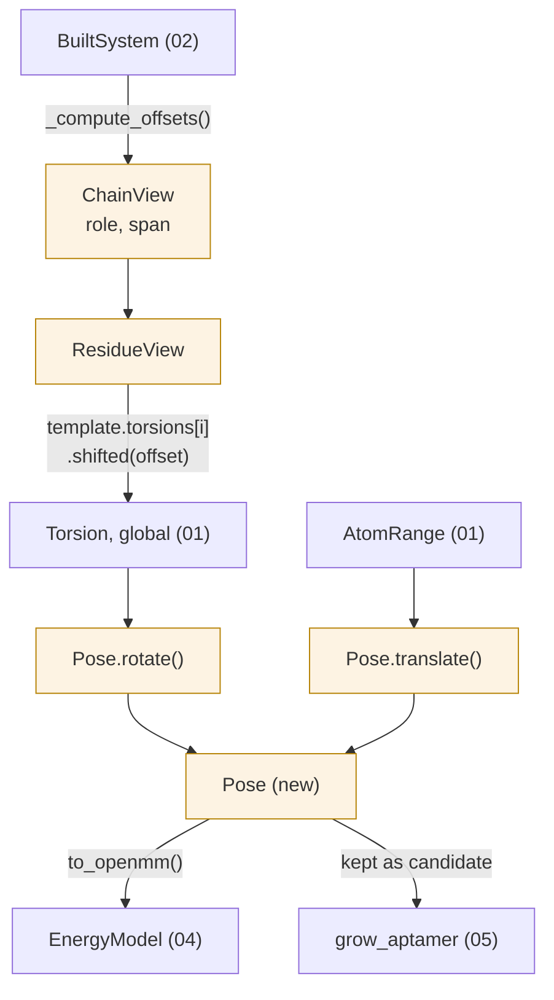

# 03 — Layer 2: Pose & ChainView

**Do:** add `maws/pose.py` with `Pose`, `ChainView`, `ResidueView`, `Edit`.
**Time:** about 4 days, split into 3 sub-steps. This is the big one.
**Risk:** high. Touches the 180 lines of junction geometry in `rebuild`.
**Replaces:** all of [`chain.py`](../../maws/chain.py) (430 lines), plus
`Complex.rotate_element`, `rotate_global`, `translate_global`, `rebuild`
(about 350 lines of [`complex.py`](../../maws/complex.py)).
**Fixes:** R2 (the reference cycle) and R3 (the loose history fields).

---

## 1. Coordinates: `list[Vec3]` becomes an ndarray

### What it is now

Positions are a Python `list` of `openmm.Vec3` objects with units attached. Every
geometry step is a Python loop over that list
([complex.py:807-813](../../maws/complex.py#L807-L813)):

```python
for j in range(element[starting_index], element[2]):
    pos[j] += shift_forward
for j in range(element[starting_index], element[2]):
    roted = np.dot(np.array(pos[j].value_in_unit(unit.angstrom)), rot)
    pos[j] = mm.Vec3(roted[0], roted[1], roted[2]) * unit.angstrom
    pos[j] -= shift_forward
self.positions = pos[:]
```

To rotate one point, that does 7 Python object operations: a `Quantity.__add__`, a
`value_in_unit` conversion, an `np.array` allocation, a 3x3 `np.dot`, a `Vec3`
construction, a `Quantity.__mul__`, and a `Quantity.__sub__`.

**How often.** Defaults are `--ntides 15` and `-c1/-c2 5000`. Step 1 does
`4 nucleotides × 5000 samples × 4 torsions`. Steps 2 to 15 do
`14 × 4 nucleotides × 2 directions × 5000 samples × 4 torsions`. Roughly
**2.3 million rotation calls**, each looping over hundreds or thousands of atoms
in Python.

The same 3x3 Rodrigues matrix is also typed out **3 separate times**, identically,
at [complex.py:554](../../maws/complex.py#L554),
[complex.py:634](../../maws/complex.py#L634), and
[complex.py:788](../../maws/complex.py#L788). 18 lines each, 54 lines total.

### What to build

One `(N, 3)` `float64` array in Å. Units are stripped at the OpenMM boundary and
put back there. Inside, the rule is "plain floats, Å" — which
[`helpers.py`](../../maws/helpers.py) already states but does not enforce.

```python
# maws/pose.py

class Pose:
    """Atom coordinates. Immutable: every method returns a new Pose.

    Coordinates are (N, 3) float64 in ångström. OpenMM Quantities are
    converted at the edges, never carried inside.
    """

    __slots__ = ("_xyz", "_system")

    def __init__(self, xyz: np.ndarray, system: BuiltSystem) -> None:
        self._xyz = np.ascontiguousarray(xyz, dtype=np.float64)
        self._xyz.flags.writeable = False        # make immutability real
        self._system = system

    def rotate(self, torsion: Torsion, angle: float) -> Pose:
        sl = torsion.moving.as_slice()
        origin = self._xyz[torsion.pivot]
        axis = self._xyz[torsion.bond] - origin
        xyz = self._xyz.copy()
        xyz[sl] = (xyz[sl] - origin) @ _rodrigues(axis, angle).T + origin
        return Pose(xyz, self._system)

    def translate(self, span: AtomRange, shift: np.ndarray) -> Pose:
        xyz = self._xyz.copy()
        xyz[span.as_slice()] += shift
        return Pose(xyz, self._system)

    def to_openmm(self) -> Quantity:
        """Attach units. Called once per energy call, not once per atom."""
        return self._xyz * unit.angstrom
```

with the Rodrigues matrix written **once**:

```python
def _rodrigues(axis: np.ndarray, angle: float) -> np.ndarray:
    """Rotation matrix for `angle` radians about `axis`. Axis need not be unit."""
    k = axis / np.linalg.norm(axis)
    K = np.array([[0, -k[2], k[1]], [k[2], 0, -k[0]], [-k[1], k[0], 0]])
    return np.eye(3) + np.sin(angle) * K + (1 - np.cos(angle)) * (K @ K)
```

Rotating `n` atoms becomes one `(n,3) @ (3,3)` BLAS call. 54 duplicated lines
become 4.

> **Not yet measured.** The speedup should be large, but I have only counted
> operations, not benchmarked. [07-migration.md](07-migration.md) makes
> benchmarking a required part of that PR.

---

## 2. The save-and-restore goes away

### What it is now

The search loop saves and restores coordinates by hand, every pass
([run.py:235-253](../../maws/run.py#L235-L253)):

```python
positions0 = cx.positions[:]              # save: copies N Quantity objects

for _ in range(self.first_chunk_size):
    pose = sampler.generator()
    rotation = rotations.generator()

    cx.translate_global(aptamer.element, pose.position * unit.angstrom)
    cx.rotate_global(aptamer.element, pose.axis * unit.angstrom, pose.angle)
    for j in range(N_BACKBONE_TORSIONS):
        aptamer.rotate_in_residue(0, j, rotation[j])

    energy = cx.get_energy()[0]
    if free_E is None or energy < free_E:
        free_E = energy
        position = cx.positions[:]        # another full copy, on every improvement
    energies.append(energy)

    cx.positions = positions0[:]          # restore: copies N Quantity objects again
```

Two full list copies per pass, three when the energy improves. The `[:]` on a
`list[Quantity]` is a shallow copy. It works only because `Quantity` arithmetic
returns new objects instead of editing in place. That is a real assumption the
code depends on and never writes down.

This is also why `copy.deepcopy(cpx)` sits in the inner loop
([run.py:230](../../maws/run.py#L230), [run.py:292](../../maws/run.py#L292)) — a
deepcopy of an object that, once built, holds an OpenMM `Simulation`, a `System`,
and an `Integrator`, all wrapping C++ handles.

### What to build

With an immutable `Pose`, saving is just keeping a name:

```python
pose0 = system.pose                       # no copy — it is a value

energies = []
best = None
for _ in range(chunk_size):
    pose = pose0                          # no restore — pose0 was never changed
    pose = pose.place(aptamer, sampler.sample())
    for j, angle in enumerate(rotations.sample()):
        pose = pose.rotate(aptamer.residue(0).torsion(j), angle)

    e = energy.evaluate(pose)
    energies.append(e)
    if best is None or e < best.energy:
        best = Candidate(energy=e, pose=pose)   # keeping it is a reference, not a copy
```

> **Built as:** two things about that loop changed. `place` centres the chain
> on the proposed position rather than putting its first atom there, because
> the first-atom reading left the chain up to 3.2 Å from where it was asked to
> go. And the loop over `torsion(j)` became `rotate_all(residue.torsions(),
> angles)`, where `torsions()` leaves out any bond whose turn moves nothing —
> which is why the number of angles drawn now comes from the number of bonds
> that came back rather than from a setting. See
> [09-audit-response.md](09-audit-response.md).

The copies left are the ones actually needed: one array copy per `rotate`. Those
are contiguous `memcpy` on a float64 buffer, not per-object Python allocation.
`copy.deepcopy` leaves the search path entirely. `Assembly` is frozen and
`BuiltSystem` is shared read-only.

---

## 3. `Chain` becomes `ChainView`

### What it is now: the cycle

`Chain` holds `self.complex`. `Complex` holds `self.chains`. So a chain reindexes
its siblings ([chain.py:135-161](../../maws/chain.py#L135-L161)):

```python
old_length = self.length
self.length = sum(map(self.structure.residue_length.__getitem__, self.sequence_array))

self.residues_start = []
tally = 0
for residue in self.sequence_array:
    self.residues_start.append(tally)
    tally += self.structure.residue_length[residue]

self.element = [self.start, self.start + 1, self.start + self.length]
start = copy.deepcopy(self.start)              # deepcopy of an int

for chain in self.complex.chains:
    chain.start_history = chain.start
    if chain.start >= start:
        chain.start += self.length - old_length          # edit siblings
        chain.element = [chain.start, chain.start + 1, chain.start + chain.length]

self.start -= self.length - old_length                   # then undo it for self
self.element = [self.start, self.start + 1, self.start + self.length]
```

`copy.deepcopy(self.start)` on an `int` is harmless, but it shows the author was
unsure what was shared. The last two lines cancel a side effect the loop just
caused, because `self` is inside `self.complex.chains`.

### What to build

`ChainView` is a window, not an owner. No back-reference. Edits nothing:

```python
# maws/pose.py

@dataclass(frozen=True, slots=True)
class ChainView:
    """A named window onto one chain in a BuiltSystem. Owns nothing."""

    role: str
    span: range                       # global atom indices
    sequence: NucleotideSequence
    library: ResidueLibrary
    _residue_offsets: tuple[int, ...]     # chain-local start of each residue

    def residue(self, index: int) -> ResidueView:
        if index < 0:
            index += len(self.sequence.tokens)
        return ResidueView(self, index)

    def __len__(self) -> int:
        return len(self.span)


@dataclass(frozen=True, slots=True)
class ResidueView:
    chain: ChainView
    index: int

    def torsion(
        self, i: int, direction: Literal["3prime", "5prime"] = "3prime"
    ) -> Torsion:
        """Return torsion `i` of this residue, in GLOBAL atom indices."""
        template = self.chain.library[self.chain.sequence.canonical(...)[self.index]]
        local = (template.torsions if direction == "3prime"
                 else template.reverse_torsions)[i]
        offset = self.chain.span.start + self.chain._residue_offsets[self.index]
        return local.shifted(offset)      # the one frame conversion in the package
```

`BuiltSystem` works out the offsets in one pass:

```python
def _compute_offsets(chains: Sequence[ChainSpec], lib) -> dict[str, AtomRange]:
    """Chain lengths in, global spans out. Pure function, no side effects."""
    offsets, cursor = {}, 0
    for spec in chains:
        n = sum(lib[r].n_atoms for r in spec.sequence.canonical(lib))
        offsets[spec.role] = AtomRange(cursor, cursor + n)
        cursor += n
    return offsets
```

26 lines of mutual editing become 8 lines of arithmetic. Editing a sequence makes
a new `Assembly`, which makes new offsets. Nothing has to be told about the
change.

---

## 4. History fields become one `Edit` value

### What it is now

`Chain` carries 6 history fields holding a pending edit, read later by
`Complex.rebuild()`:

| Field | Written by | Read by |
| --- | --- | --- |
| `start_history` | `create_sequence`, `append_sequence`, `prepend_sequence` | `rebuild`, `rotate_historic_element` |
| `length_history` | same three | `rebuild` |
| `append_history` | `append_sequence` | `rebuild` |
| `prepend_history` | `prepend_sequence` | `rebuild`, `rotate_in_historic_residue` |
| `sequence_array_history` | `create_sequence` | nothing — dead, marked "kept for compatibility" ([chain.py:201](../../maws/chain.py#L201)) |
| `element` | everywhere | `rebuild`, callers |

`rebuild()` then branches on which of these is non-empty
([complex.py:511-689](../../maws/complex.py#L511-L689)) — 180 lines with 3
mutually exclusive paths.

Two problems, neither written down anywhere, both reachable from the public API:

1. **Two edits before one rebuild.** `append_sequence` clears `prepend_history`
   ([chain.py:229](../../maws/chain.py#L229)) but `prepend_sequence` does not
   clear `append_history`. So append-then-prepend leaves both set, and `rebuild`
   runs both branches. The second one works on coordinates the first already
   rewrote.
2. **Rebuild twice.** `rebuild()` never clears the history after reading it, so
   calling it twice reapplies the junction geometry to already-adjusted
   coordinates.

### What to build

Make the edit a value and the rebuild a function of it:

```python
@dataclass(frozen=True, slots=True)
class Edit:
    """One sequence change that already happened, plus what rebuild needs."""

    role: str
    kind: Literal["append", "prepend", "replace"]
    added: tuple[str, ...]
    old_span: range
    new_span: range


def regrow(system: BuiltSystem, edit: Edit, old: Pose, builder: Builder) -> Pose:
    """Rebuild after `edit`, keeping coordinates outside the junction."""
    new_system = builder.build(system.assembly, system.forcefield)
    match edit.kind:
        case "append":  return _splice_tail(new_system, edit, old)
        case "prepend": return _splice_head(new_system, edit, old)
        case "replace": return _splice_whole(new_system, edit, old)
```

Because `Edit` is an argument instead of hidden state:

- Two-edits-before-rebuild cannot be written. You pass one `Edit`.
- Rebuilding twice is harmless. `regrow` is a pure function of its inputs.
- The 3 branches become 3 named functions, each testable against a 20-atom `Pose`
  built by hand.

The two "historic" methods,
[`rotate_historic_element`](../../maws/chain.py#L376) and
[`rotate_in_historic_residue`](../../maws/chain.py#L408), only exist to shift
indices captured before an edit. With `Edit` carrying `old_span` and `new_span`,
that is one expression at the call site.

**Both are dead code.** `grep` finds only their own definitions, no callers.

---

## 5. The geometry surface, before and after

| Now | Proposed | Note |
| --- | --- | --- |
| `Chain.rotate_element(element, angle, reverse)` | `Pose.rotate(torsion, angle)` | frame and flag gone |
| `Chain.rotate_in_residue(ri, ei, angle, reverse)` | `Pose.rotate(chain.residue(ri).torsion(ei, direction), angle)` | applied once, not 3 times |
| `Chain.rotate_historic_element(...)` | — | deleted; unused |
| `Chain.rotate_in_historic_residue(...)` | — | deleted; unused |
| `Chain.update_chains()` | `BuiltSystem._compute_offsets()` | computed, not propagated |
| `Chain.create_sequence(s)` | `Assembly.with_sequence(role, s)` | returns a new assembly |
| `Chain.append_sequence(s)` | `NucleotideSequence.appended(t)` + `Edit` | edit is explicit |
| `Complex.rotate_element(el, angle, reverse)` | `Pose.rotate(torsion, angle)` | hidden swap gone |
| `Complex.rotate_global(el, axis, angle, reverse, glob)` | `Pose.rotate(torsion, angle)` | 2 flags gone |
| `Complex.translate_global(el, shift)` | `Pose.translate(span, shift)` | takes a range, not a triple |
| `Complex.rebuild(path, name, exclusion)` | `regrow(system, edit, pose, builder)` | pure function |

11 methods across 2 classes become 4. The complexity does not move somewhere else.
It goes away, because `reverse`, `glob`, frame ambiguity, and implicit history stop
existing as ideas.

---

## 6. A full sampling step

```python
from maws import Assembly, ForceField, ResidueLibrary, build, entropy_score
from maws.sampling import SurfaceSampler, NAngles

ff = ForceField.for_target("RNA", "protein", salt_conc=0.15)
system = build(
    Assembly()
      .with_aptamer(ResidueLibrary.rna(), sequence="G")
      .with_ligand("protein.pdb", ff),
    ff,
)

aptamer = system.chain("aptamer")
energy = system.energy_model()
sampler = SurfaceSampler.around(system.chain("ligand"), reach=10.0, probe=1.4)
angles = NAngles(4)

base = system.pose                       # bound once; never copied, never restored
best, energies = None, []

for _ in range(5000):
    placement = sampler.sample()
    pose = base.place(aptamer, placement)
    for i, theta in enumerate(angles.sample()):
        pose = pose.rotate(aptamer.residue(0).torsion(i), theta)

    e = energy.evaluate(pose)
    energies.append(e)
    if best is None or e < best[0]:
        best = (e, pose)

score = entropy_score(energies, beta=0.01)
```

That is the same computation as
[run.py:224-267](../../maws/run.py#L224-L267). Gone: `copy.deepcopy`,
`positions0 = cx.positions[:]`, `cx.positions = positions0[:]`,
`* unit.angstrom` at 4 call sites, the `aptamer.element` triple, and the `[0]` on
`get_energy()`'s tuple.

---

## 7. How it fits together



Note what is missing: no arrow from `ChainView` back to `BuiltSystem`, and none
from `Pose` to `ChainView`. The graph has no cycles. So `ChainView` can be built
in a test from a literal `AtomRange`, with no built system at all.

**Next:** [04-energy.md](04-energy.md).
</content>
