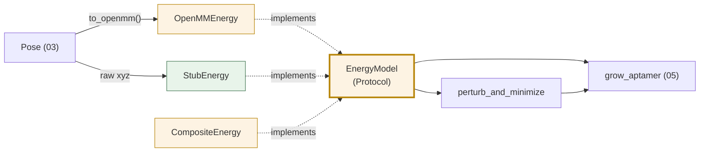

# 04 — Layer 2: Energy

**Do:** add `maws/energy.py` with an `EnergyModel` protocol, `OpenMMEnergy`, and
`StubEnergy`.
**Time:** about 1 day.
**Risk:** low. `Complex` keeps working by delegating.
**Replaces:** `Complex.get_energy`, `minimize`, `step`, `pert_min`,
`rigid_minimize`, `_make_system`, `_create_simulation` (about 200 lines of
[`complex.py`](../../maws/complex.py)).
**Fixes:** C2 — nothing in the search path is testable today without AmberTools,
LEaP, and an OpenMM platform.

Smallest doc here. Best return per line changed.

---

## 1. OpenMM is welded to the container

### What it is now

`Complex` holds the simulation machinery as instance state
([complex.py:75-82](../../maws/complex.py#L75-L82)):

```python
self.prmtop: app.AmberPrmtopFile | None = None
self.inpcrd: app.AmberInpcrdFile | None = None
self.system: mm.System | None = None
self.integrator: mm.Integrator | None = None
self.simulation: app.Simulation | None = None
```

Every energy call goes through it
([complex.py:846-860](../../maws/complex.py#L846-L860)):

```python
def get_energy(self) -> tuple[float, list[mm.Vec3]]:
    self.simulation.context.setPositions(self.positions)
    state = self.simulation.context.getState(getPositions=True, getEnergy=True, groups=1)
    free_E = state.getPotentialEnergy().value_in_unit(unit.kilojoules_per_mole)
    return free_E, self.positions
```

Three problems:

1. **Nothing above this can be tested.** To run the growth algorithm you need
   AmberTools on `PATH`, a working `tleap`, and an OpenMM platform.
   [`tests/test_complex.py`](../../tests/test_complex.py) is limited for that
   reason, and `pyproject.toml` already has an `integration` marker to fence off
   what CI cannot run.
2. **The return type is awkward.** `get_energy()` returns `(energy, positions)`,
   but the caller already has the positions. Every call site writes
   `cx.get_energy()[0]` and throws the second item away. That happens at
   [run.py:247](../../maws/run.py#L247), [run.py:327](../../maws/run.py#L327),
   [maws2023.py:299](../../maws/maws2023.py#L299),
   [maws2023.py:395](../../maws/maws2023.py#L395), and
   [complex.py:951](../../maws/complex.py#L951).
3. **`groups=1` is unexplained.** `getState(..., groups=1)` limits the energy to
   force group 0. `createSystem` is never told to assign force groups, so this
   probably means "all forces" — but `groups=1` is a bitmask picking group 0, not
   a count. If a force ever lands in another group, its contribution is dropped
   silently. Worth a comment, and worth checking.

---

## 2. What to build

```python
# maws/energy.py

class EnergyModel(Protocol):
    """Anything that can score and relax a Pose."""

    def evaluate(self, pose: Pose) -> float:
        """Potential energy in kJ/mol."""

    def minimize(self, pose: Pose, *, max_iterations: int = 100) -> Relaxed:
        """Local minimisation. Returns the relaxed pose and its energy."""


class Relaxed(NamedTuple):
    energy: float
    pose: Pose
```

`evaluate` returns a `float`, not a tuple. The 5 `[0]` subscripts get deleted.

`Relaxed` is a `NamedTuple`, not a dataclass, so both spellings work:

```python
energy, pose = model.minimize(pose)     # old-style unpacking still works
result.energy                           # and names work
```

That follows `scipy.optimize.OptimizeResult` and `os.stat_result`: a result that
used to be a bare tuple grows names without breaking callers. It matters here
because `get_energy()` returns a 2-tuple today and callers unpack it.

### The real one

```python
class OpenMMEnergy:
    """EnergyModel backed by an OpenMM Context. Owns all OpenMM state.

    This class is the only place in the package that imports openmm.app,
    builds a System, or holds a Context.
    """

    def __init__(
        self,
        prmtop: app.AmberPrmtopFile,
        ff: ForceField,
        *,
        platform: str | None = None,
    ) -> None:
        self._system = prmtop.createSystem(
            nonbondedMethod=app.NoCutoff,
            nonbondedCutoff=5 * unit.angstrom,
            constraints=None,
            implicitSolvent=app.OBC1,
            implicitSolventSaltConc=ff.salt_conc * unit.molar,
        )
        integrator = mm.LangevinIntegrator(
            300.0 * unit.kelvin, 1.0 / unit.picosecond, 0.002 * unit.picoseconds
        )
        self._sim = _make_simulation(prmtop.topology, self._system, integrator, platform)

    def evaluate(self, pose: Pose) -> float:
        self._sim.context.setPositions(pose.to_openmm())
        state = self._sim.context.getState(getEnergy=True)
        return state.getPotentialEnergy().value_in_unit(unit.kilojoules_per_mole)

    def minimize(self, pose: Pose, *, max_iterations: int = 100) -> Relaxed:
        self._sim.context.setPositions(pose.to_openmm())
        self._sim.minimizeEnergy(maxIterations=max_iterations)
        state = self._sim.context.getState(getPositions=True, getEnergy=True)
        return Relaxed(
            energy=state.getPotentialEnergy().value_in_unit(unit.kilojoules_per_mole),
            pose=Pose.from_openmm(state.getPositions(), pose.system),
        )
```

The platform-picking logic from
[complex.py:234-278](../../maws/complex.py#L234-L278) moves to a module-level
`_make_simulation`, unchanged. That includes the `MAWS_OPENMM_PLATFORM` override
and the CUDA, then OpenCL, then default fallback. It is good logic. It just does
not belong on a chain container.

### The test one

This is the point of the whole doc:

```python
class StubEnergy:
    """Deterministic EnergyModel for tests. No OpenMM, no AmberTools.

    Energy is pairwise repulsion between two named chains, so poses that
    move them apart score lower. Enough structure for the growth search
    to have something to optimise.
    """

    def __init__(self, a: AtomRange, b: AtomRange, *, scale: float = 1.0) -> None:
        self._a, self._b, self._scale = a, b, scale

    def evaluate(self, pose: Pose) -> float:
        xa = pose.xyz[self._a.as_slice()]
        xb = pose.xyz[self._b.as_slice()]
        d2 = ((xa[:, None, :] - xb[None, :, :]) ** 2).sum(-1)
        return float(self._scale * np.reciprocal(np.maximum(d2, 1e-6)).sum())

    def minimize(self, pose: Pose, *, max_iterations: int = 100) -> Relaxed:
        return Relaxed(self.evaluate(pose), pose)     # no-op relaxation
```

### A test you cannot write today

```python
def test_growth_prefers_lower_entropy_candidate():
    """The search must pick the nucleotide with the lowest entropy score.

    Runs in milliseconds. No AmberTools, no LEaP, no OpenMM platform.
    """
    system = FakeBuilder().build(
        Assembly()
          .with_aptamer(ResidueLibrary.rna(), sequence="G")
          .with_ligand_stub(n_atoms=40),
        ForceField.for_target("RNA", "protein"),
    )

    events = list(grow_aptamer(
        system,
        energy=StubEnergy(system.chain("aptamer").span, system.chain("ligand").span),
        sampler=FixedSampler(seed=0),
        n_nucleotides=3,
        chunk_size=20,
    ))

    completed = [e for e in events if isinstance(e, StepCompleted)]
    assert len(completed) == 3
    assert all(len(e.sequence.tokens) == i + 1 for i, e in enumerate(completed))
```

The closest existing test, [`tests/test_run.py`](../../tests/test_run.py), can
only check argument validation in `MawsRunner.__init__`. The algorithm itself is
out of reach without the full toolchain.

---

## 3. The two heuristics

### `pert_min`

A `Complex` method today ([complex.py:956-970](../../maws/complex.py#L956-L970)):

```python
def pert_min(self, size: float = 1e-1, iterations: int = 50) -> None:
    for _repeat in range(iterations):
        for i in range(len(self.positions)):
            self.positions[i] += np.random.uniform(-size, size, 3) * unit.angstrom
        self.minimize()
```

That is a search strategy, not a property of a molecular container. It is called
from the growth loop at [run.py:305](../../maws/run.py#L305) and
[maws2023.py:373](../../maws/maws2023.py#L373). Make it a free function over the
protocol, which also vectorises the per-atom Python loop:

```python
# maws/relax.py
def perturb_and_minimize(
    pose: Pose, energy: EnergyModel, *, size: float = 0.1, iterations: int = 50,
    rng: np.random.Generator | None = None,
) -> Relaxed:
    """Kick every atom by U(-size, size) Å, then minimise. Repeat."""
    rng = rng or np.random.default_rng()
    result = Relaxed(energy.evaluate(pose), pose)
    for _ in range(iterations):
        kicked = pose.jittered(rng.uniform(-size, size, pose.xyz.shape))
        result = energy.minimize(kicked)
        pose = result.pose
    return result
```

> **Built as:** it takes a `moving` argument as well, naming which atoms may be
> nudged. Kicking every atom kicks the target too, and the target is not
> something being fitted — it is what the fits are judged against, so shaking
> it moves the goalposts differently for every candidate. For the same reason
> `OpenMMEnergy` takes atoms to freeze during minimisation. See
> [09-audit-response.md](09-audit-response.md).

The `rng` argument is new and deliberate. Today the code calls `np.random.*` on
global state ([complex.py:946-948](../../maws/complex.py#L946-L948),
[space.py:109](../../maws/space.py#L109),
[space.py:170](../../maws/space.py#L170)), so runs cannot be repeated. Passing a
`Generator` makes `--seed` work. See [06-cli.md](06-cli.md).

### `rigid_minimize` — question 2 for you

[complex.py:932-954](../../maws/complex.py#L932-L954):

```python
energy = None
for _i in range(max_iterations):
    for chain in self.chains:
        for idx, residue in enumerate(chain.sequence_array):
            for _j in range(max_step_iterations):
                positions = self.positions[:]
                ...
                free_E = self.get_energy()[0]
                if free_E < energy or energy is None:      # TypeError on pass 1
                    energy = free_E
                    self.positions = positions[:]          # restores the OLD pose
```

Two apparent faults:

1. `energy` starts as `None`. Python evaluates `free_E < energy` before the `or`,
   so `float < None` raises `TypeError` on the first pass. The guard order is
   backwards. It should be `if energy is None or free_E < energy`.
2. The body restores `positions` — the coordinates from before the rotation — when
   the energy improves. That throws the improvement away and keeps the worse pose.

Nothing calls this method. No test covers it.

**Recommendation: delete it.** If the idea is worth keeping, write it fresh in
`maws/relax.py` next to `perturb_and_minimize`, with a test. Carrying it into a
clean layer unexamined moves a fault along with it.

> Reading of the control flow, not a run. Question 2 in
> [README.md](README.md#3-questions-for-you).

---

## 4. What the protocol buys you

Three things become possible that are not possible today.

**Repeatable runs.** With `EnergyModel` as a seam, a `RecordingEnergy` wrapper can
log every `(pose_hash, energy)` pair, and a `ReplayEnergy` can feed them back. A
failed run becomes reproducible offline without the original environment.

**Other scorers.** Your lab-failure notes point at a folding-ΔG filter as the next
lever. Under the protocol that is composition, not a fork of the search:

```python
class CompositeEnergy:
    """Weighted sum of several EnergyModels."""

    def __init__(self, *parts: tuple[EnergyModel, float]) -> None:
        self._parts = parts

    def evaluate(self, pose: Pose) -> float:
        return sum(w * m.evaluate(pose) for m, w in self._parts)
```

**CI that runs the algorithm.** Today
[`.github/workflows/ci.yml`](../../.github/workflows/ci.yml) can only run tests
that avoid AmberTools. With `StubEnergy` and `FakeBuilder`, the growth search,
selection logic, event stream, and CLI wiring all become ordinary unit tests on a
pip-only runner.

---

## 5. How it fits together



`grow_aptamer` in [05-search.md](05-search.md) depends on the protocol, never on
`OpenMMEnergy`. That one arrow is what makes Layer 3 testable.

**Next:** [05-search.md](05-search.md).
</content>
