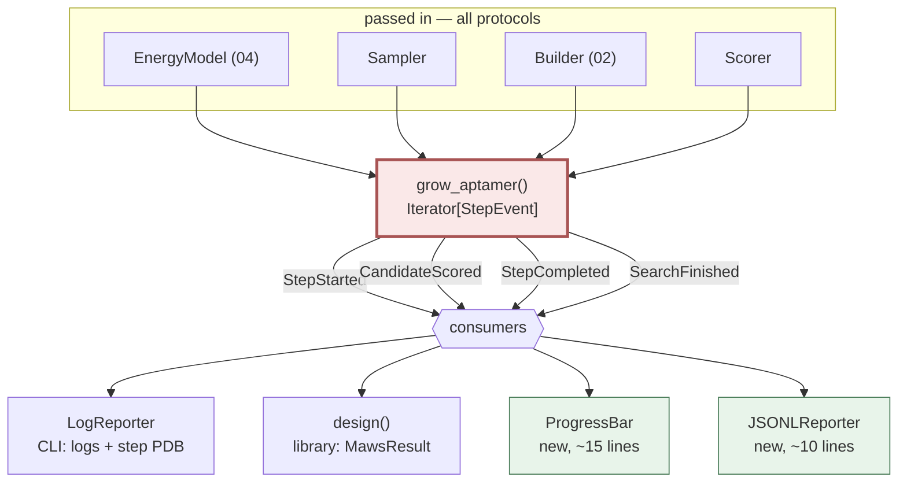

# 05 — Layer 3: Search

**Do:** add `maws/search.py` with `grow_aptamer()` and 4 event types. Rewrite both
callers to use it.
**Time:** about 3 days, including the equivalence tests.
**Risk:** medium. Must produce identical results to today.
**Replaces:** the loop in `MawsRunner.run`
([run.py:224-350](../../maws/run.py#L224-L350)) and the loop in `maws2023.main`
([maws2023.py:271-445](../../maws/maws2023.py#L271-L445)).
**Fixes:** C1 — the algorithm is written out twice.

This step deletes about 350 lines.

---

## 1. The duplication

Same algorithm, two files. Step 2..N from each, side by side:

```python
# run.py:286-334                            # maws2023.py:354-403
for ntide in nt_list:                       for ntide in nt_list:
  for append in (True, False):                for append in [True, False]:
    energies = []                               energies = []
    free_E = None                               free_E = None
    position = None                             position = None
    cx = copy.deepcopy(cpx)                     cx = copy.deepcopy(cpx)
    aptamer = cx.aptamer_chain()                aptamer = cx.aptamer_chain()
    aptamer.create_sequence(best_old_sequence)  aptamer.create_sequence(best_old_sequence)
    cx.build()                                  cx.build()
    cx.positions = best_old_positions[:]        cx.positions = best_old_positions[:]
    if append:                                  if append:
        aptamer.append_sequence(ntide)              aptamer.append_sequence(ntide)
    else:                                       else:
        aptamer.prepend_sequence(ntide)             aptamer.prepend_sequence(ntide)
    cx.rebuild()                                cx.rebuild()
    cx.pert_min(size=0.5)                       cx.pert_min(size=0.5)
    positions0 = cx.positions[:]                positions0 = cx.positions[:]
    for _ in range(self.second_chunk_size):     for _ in range(SECOND_CHUNK_SIZE):
        rotation = rotations.generator()            rotation = rotations.generator()
        ...                                         ...
```

They differ in one place: what happens after `entropy_score`.

| | `run.py` | `maws2023.py` |
| --- | --- | --- |
| per candidate | `log.debug(...)` | `logger.info(...)` and `entropy_log.write(...)` |
| per step | nothing | `app.PDBFile.writeModel(..., file=step)` |
| also tracks | `best_energy` | `best_topology` |
| gives back | a `MawsResult` | writes `{JOB_NAME}_RESULT.pdb` |

That is the whole difference: reporting. About 480 lines to express one algorithm
and two output formats.

### What it costs

- A folding-ΔG filter has to be written twice.
- `run.py` tracks `best_energy`; `maws2023.py` does not. So the CLI cannot report
  the winner's energy even though it computed it.
- `maws2023.py` tracks `best_topology` with `copy.deepcopy(cx.topology)`
  ([maws2023.py:335](../../maws/maws2023.py#L335)) — a deepcopy of an OpenMM
  object, once per step. `run.py` avoids that by rebuilding at the end.
- Fix one and not the other and they drift apart. No test checks they agree.

---

## 2. What to build: one generator, typed events

```python
# maws/search.py

@dataclass(frozen=True, slots=True)
class Candidate:
    """One (nucleotide, direction) proposal that has been scored."""

    sequence: NucleotideSequence
    nucleotide: str
    direction: Literal["3prime", "5prime"]
    entropy: float
    energy: float
    pose: Pose


class StepEvent: ...

@dataclass(frozen=True, slots=True)
class StepStarted(StepEvent):
    step: int
    total: int
    sequence: NucleotideSequence

@dataclass(frozen=True, slots=True)
class CandidateScored(StepEvent):
    step: int
    candidate: Candidate

@dataclass(frozen=True, slots=True)
class StepCompleted(StepEvent):
    step: int
    winner: Candidate

@dataclass(frozen=True, slots=True)
class SearchFinished(StepEvent):
    winner: Candidate
    steps: int
```

The algorithm, written once:

```python
def grow_aptamer(
    system: BuiltSystem,
    *,
    energy: EnergyModel,
    sampler: Sampler,
    builder: Builder,
    n_nucleotides: int,
    alphabet: str,
    first_chunk: int = 5000,
    chunk: int = 5000,
    beta: float = 0.01,
    scorer: Scorer = entropy_score,
    rng: np.random.Generator | None = None,
) -> Iterator[StepEvent]:
    """Grow an aptamer one nucleotide at a time, yielding events as it goes.

    Yields
    ------
    StepStarted, then one CandidateScored per proposal, then StepCompleted,
    per step. SearchFinished once at the end.
    """
    rng = rng or np.random.default_rng()

    yield StepStarted(step=1, total=n_nucleotides, sequence=NucleotideSequence(()))
    best = _best_of(
        _seed_candidates(system, energy, sampler, alphabet, first_chunk, beta, scorer, rng)
    )
    yield StepCompleted(step=1, winner=best)

    for step in range(2, n_nucleotides + 1):
        yield StepStarted(step=step, total=n_nucleotides, sequence=best.sequence)
        scored = []
        for nt in alphabet:
            for direction in ("3prime", "5prime"):
                cand = _grow_one(system, best, nt, direction, energy, builder,
                                 chunk, beta, scorer, rng)
                scored.append(cand)
                yield CandidateScored(step=step, candidate=cand)
        best = _best_of(scored)
        yield StepCompleted(step=step, winner=best)

    yield SearchFinished(winner=best, steps=n_nucleotides)
```

Both callers become short and obviously equivalent.

### The library consumer

```python
# maws/api.py
def design(pdb, *, n_nucleotides=15, aptamer="RNA", molecule="protein", **kw) -> MawsResult:
    """Design an aptamer. The one-call entry point."""
    system, energy, sampler, builder = _prepare(pdb, aptamer, molecule, **kw)

    winner = None
    for event in grow_aptamer(system, energy=energy, sampler=sampler,
                              builder=builder, n_nucleotides=n_nucleotides, **kw):
        if isinstance(event, SearchFinished):
            winner = event.winner

    return MawsResult(
        sequence=str(winner.sequence),
        energy=winner.energy,
        entropy=winner.entropy,
        pose=winner.pose,
    )
```

### The CLI consumer

```python
# maws/cli.py
class LogReporter:
    """Turns StepEvents into the CLI's log and PDB files."""

    def __init__(self, job: str, log: logging.Logger) -> None:
        self._log = log
        self._entropy = open(f"{job}_entropy.log", "w")
        self._steps = open(f"{job}_step_cache.pdb", "w")

    def __call__(self, event: StepEvent) -> None:
        match event:
            case StepStarted(step=s, total=n, sequence=seq):
                self._log.info("Step %d/%d: growing from %s", s, n, seq or "(empty)")
            case CandidateScored(candidate=c):
                self._log.info(
                    "  %s %s -> entropy=%.6f energy=%.2f",
                    c.nucleotide, c.direction, c.entropy, c.energy,
                )
                self._entropy.write(
                    f"SEQUENCE: {c.sequence} ENTROPY: {c.entropy} ENERGY: {c.energy}\n"
                )
            case StepCompleted(step=s, winner=w):
                self._log.info("Step %d complete. Best: %s", s, w.sequence)
                write_pdb(self._steps, w.pose, model_index=s)
            case SearchFinished(winner=w, steps=n):
                self._log.info("Done after %d steps: %s (E=%.2f)", n, w.sequence, w.energy)
```

Both files `maws2023.py` writes — `{job}_entropy.log` and `{job}_step_cache.pdb` —
keep the same format. CLI behaviour does not change. Only where the code lives.

The CLI also gains something it was missing: `CandidateScored` carries `energy`, so
it can now report the winner's energy. Today `maws2023.py` computes that and throws
it away.

---

## 3. Scorers as a protocol

`entropy_score` ([routines.py:56](../../maws/routines.py#L56)) is already a clean
pure function: `(energies, beta) -> float`. Naming its shape makes it swappable:

```python
class Scorer(Protocol):
    def __call__(self, energies: Sequence[float], *, beta: float) -> float:
        """Lower is better."""
```

`entropy_score` satisfies this with no change. The folding-ΔG filter then composes
instead of forking the search:

```python
def with_folding_penalty(base: Scorer, weight: float, fold: FoldingModel) -> Scorer:
    """Penalise candidates whose sequence does not fold (mfold ΔG near 0)."""
    def scored(energies, *, beta, sequence=None):
        return base(energies, beta=beta) + weight * fold.penalty(sequence)
    return scored
```

That is the concrete return on unifying the search: the next scientific lever
becomes about 10 lines applied at one call site, instead of a parallel edit to two
150-line loops.

---

## 4. Two changes to sampling

[`space.py`](../../maws/space.py) is the best-factored module in the package and
needs no structural work. Two small changes.

**`.generator()` is not a generator.** It returns one `Sample`
([space.py:348](../../maws/space.py#L348),
[space.py:184](../../maws/space.py#L184)). Rename it `.sample()` and add
`__iter__` for callers who want a stream:

```python
class Sampler(Protocol):
    def __next__(self) -> Sample: ...
    def __iter__(self) -> Sampler: return self
```

Implementing the iterator protocol gets `next(sampler)`, `islice(sampler, 5000)`,
`zip(sampler, angles)`, and `for s in sampler` with no extra code. A `.sample()`
method would also read against `random.sample()`, which means "pick k items
without replacement."

Then the search reads as:

```python
for placement in islice(sampler, chunk_size):
    ...
```

**Global RNG state.** `space.py` calls `np.random.*` directly at
[space.py:109](../../maws/space.py#L109),
[space.py:128-129](../../maws/space.py#L128-L129),
[space.py:170](../../maws/space.py#L170),
[space.py:185](../../maws/space.py#L185), and
[space.py:432-435](../../maws/space.py#L432-L435). `Complex.pert_min` and
`rigid_minimize` do the same.

**So no MAWS run can be repeated.** For a random tool whose output becomes a lab
protocol, that matters.

Passing an `np.random.Generator` through the samplers and the search makes
`--seed` work and makes search tests deterministic:

```python
@dataclass
class SurfaceSampler:
    envelope: Envelope
    excluder: Excluder
    max_rejections: int = 1000
    rng: np.random.Generator = field(default_factory=np.random.default_rng)
```

---

## 5. How it fits together



The two green consumers are hard to add today. A progress bar would mean editing
both loops. Under the event stream it is a function that matches on `StepStarted`.
Same for JSONL output, which is what makes `maws design --format jsonl` in
[06-cli.md](06-cli.md) a 10-line addition instead of a third copy of the loop.

---

## 6. What stays identical

The science does not change:

- `entropy_score`, including the `logsumexp` log-space evaluation.
- The growth strategy: try all 4 nucleotides on both ends, keep lowest entropy.
- `first_chunk_size` vs `second_chunk_size`. Step 1 samples placement and
  orientation. Later steps sample only torsions.
- The torsion pattern in later steps: 3 forward torsions on the new residue plus
  one backward C3'-O3' torsion on its neighbour
  ([run.py:313-325](../../maws/run.py#L313-L325)).
- `pert_min(size=0.5)` after each `rebuild`.
- SAS rejection, Bondi radii, and envelope sizing in `space.py`.

One behaviour change may fall out. If the `rotate_in_residue` triple-application in
[01-values.md](01-values.md#2-the-bug-this-makes-impossible) is a real bug, fixing
it changes every result. That is why it is sequenced first and separately in
[07-migration.md](07-migration.md).

**Next:** [06-cli.md](06-cli.md).
</content>
