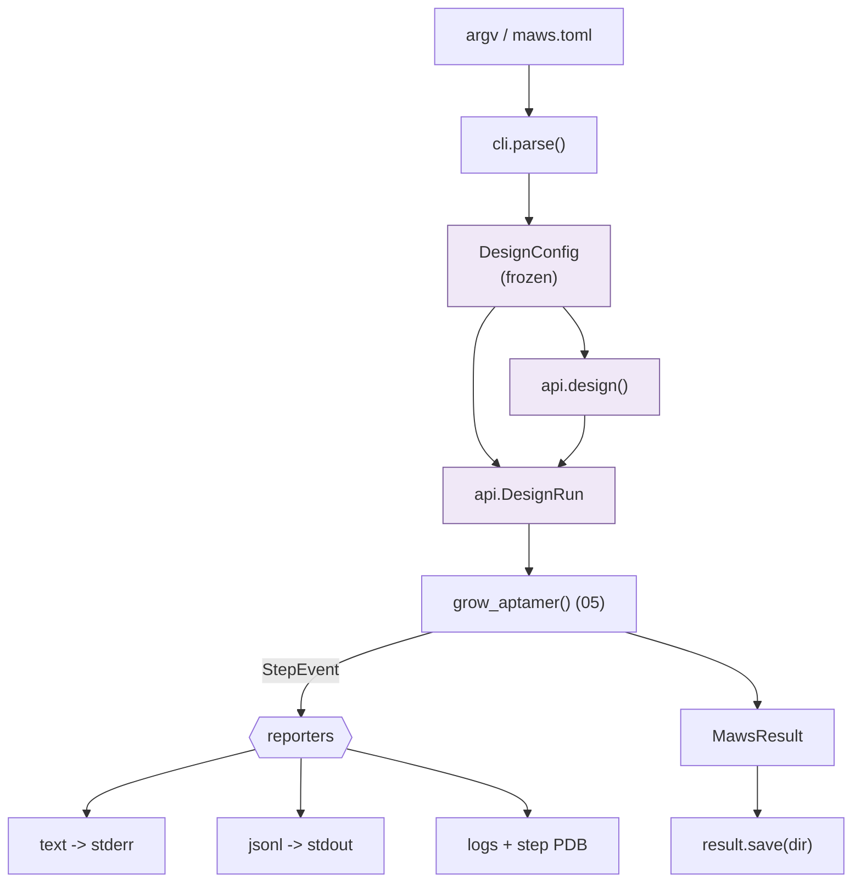

# 06 — Layer 4: Public API & CLI

**Do:** add `maws/cli.py` and a `[project.scripts]` block to `pyproject.toml`.
**Time:** about 2 days.
**Risk:** medium. Old flags keep working through a translation shim.
**Replaces:** `maws2023.parse_args` and `main`
([maws2023.py:37-130](../../maws/maws2023.py#L37-L130), 468 lines total), plus
`maws/__init__.py`'s two-name export.

---

## 1. There is no installed CLI today

`pyproject.toml` has **no `[project.scripts]` block**. After `pip install maws`
there is no `maws` command. The only ways in:

```console
$ python -m maws.maws2023 -nt 15 -p ligand.pdb
$ python maws/maws2023.py -nt 15 -p ligand.pdb
```

The module name is also a problem. `maws2023` is a date stamp from a fork. The
file header says `VERSION = "1.0" # Siddharth` and `RELEASE_DATE = "2025"`
([maws2023.py:24-25](../../maws/maws2023.py#L24-L25)) while `pyproject.toml` says
`version = "0.1.0.dev0"`. Three version numbers, none of them the real one.

### Flag names

```console
$ python -m maws.maws2023 -nt 15 -ta RNA -tm protein -c1 5000 -c2 5000 -b 0.01
```

`-nt`, `-ta`, `-tm`, `-c1`, `-c2` are two-character abbreviations. `-nt` is not a
standard short option either; it is a long option with one dash.

The long forms are `--ntides`, `--aptamertype`, `--moleculetype`,
`--firstchunksize`, `--secondchunksize` — words run together. The newer flags use
hyphens: `--clean-pdb`, `--keep-chains`, `--drop-hetatm`, `--salt-conc`. So the
interface has two naming styles.

### Everything writes to the current directory

```python
# maws2023.py:155
file_handler = logging.FileHandler(f"{JOB_NAME}_output.log", mode="w")
# maws2023.py:166-167
open(f"{JOB_NAME}_entropy.log", "w")
open(f"{JOB_NAME}_step_cache.pdb", "w")
# maws2023.py:454
result_pdb_name = f"{JOB_NAME}_RESULT.pdb"
```

4 files, all relative to `cwd`, with no `--output-dir`. `.maws_cache/`
([complex.py:415](../../maws/complex.py#L415)) is also relative. And `make_lib`
writes `LIG.lib` and `LIG.frcmod` next to the **input** PDB
([prepare.py:98](../../maws/prepare.py#L98)), so a run drops files into the folder
holding your data.

---

## 2. What to build

One installed entry point with subcommands:

```toml
# pyproject.toml
[project.scripts]
maws = "maws.cli:main"
```

```console
$ maws --help
usage: maws [-h] [--version] {design,prepare,inspect,clean} ...

MAWS — Making Aptamers With Software

commands:
  design    Design an aptamer against a target (the main workflow)
  prepare   Turn a ligand PDB into .lib/.frcmod without designing
  inspect   Show what a run would do, without running it
  clean     Clean a PDB for LEaP (chains, hydrogens, HETATM)

  -h, --help     show this help message and exit
  --version      show program's version number and exit
```

### `maws design`

```console
$ maws design --help
usage: maws design [-h] --target PDB [-n NAME] [-o DIR] [--length N]
                   [--aptamer {RNA,DNA}] [--molecule {protein,organic,lipid}]
                   [--samples N] [--first-samples N] [--beta FLOAT]
                   [--reach A] [--probe A] [--salt-conc M] [--seed N]
                   [--sampling {sphere,surface-following}]
                   [--format {text,json,jsonl}] [-v | -q] [--config FILE]

required:
  --target PDB          Target molecule PDB (what the aptamer should bind)

output:
  -n, --name NAME       Job name used in filenames  [MAWS_aptamer]
  -o, --output DIR      Directory for all output files  [.]
  --format FMT          Result format on stdout  [text]

design:
  --length N            Nucleotides in the aptamer  [15]
  --aptamer TYPE        RNA or DNA  [RNA]
  --molecule TYPE       Target type: protein, organic, lipid  [protein]

sampling:
  --samples N           Samples per growth step  [5000]
  --first-samples N     Samples in step 1  [same as --samples]
  --beta FLOAT          Inverse temperature for the entropy score  [0.01]
  --reach A             How far the envelope extends past the target, Å  [10.0]
  --probe A             vdW probe radius for SAS rejection, Å  [1.4]
  --sampling MODE       sphere | surface-following  [sphere]
  --seed N              RNG seed, for a repeatable run  [random]

physics:
  --salt-conc M         Monovalent salt, mol/L, for GB screening  [0.15]
```

### Renames

| Now | Proposed | Why |
| --- | --- | --- |
| `-p/--path` | `--target` | "path" says nothing about what the file is |
| `-nt/--ntides` | `--length` | plainer word for the same number |
| `-ta/--aptamertype` | `--aptamer` | the `type` suffix adds nothing |
| `-tm/--moleculetype` | `--molecule` | same |
| `-c1/--firstchunksize` | `--first-samples` | "chunk" is internal; users pick a sample count |
| `-c2/--secondchunksize` | `--samples` | the common one, so it gets the plain name |

New flags:

| Flag | Why |
| --- | --- |
| `-o/--output` | stop writing 4 files into `cwd` |
| `--seed` | makes runs repeatable ([05-search.md](05-search.md#4-two-changes-to-sampling)) |
| `--format` | machine-readable output, a ~10-line event consumer |
| `--config` | see below |
| `-v/-q` | verbosity is a `MawsRunner` kwarg today, unreachable from the CLI |

Old flags stay as hidden aliases for one release. See
[07-migration.md](07-migration.md).

### `maws prepare` and `maws inspect`

`prepare` exposes `make_lib`, which today only runs as a side effect of
`Complex.add_chain_from_pdb`:

```console
$ maws prepare --target protein.pdb --molecule protein --output ./params/
Wrote params/protein_a3f2c1.lib   (2,847 atoms)
```

The residue name comes from the source file, not the hardcoded `LIG`. That is the
fix described in [02-topology.md](02-topology.md#4-the-build-cache).

`inspect` works only because `Assembly` has no side effects
([02-topology.md](02-topology.md#3-assembly-and-builtsystem)). You can describe a
run and hash it without running anything:

```console
$ maws inspect --target protein.pdb --aptamer DNA --molecule protein
Assembly
  aptamer   DNA   leaprc.DNA.OL21    sequence: (empty)
  ligand    PDB   leaprc.protein.ff19SB   protein.pdb (2,847 atoms)
Force field
  salt_conc 0.15 mol/L    parameterized: yes    alphabet: GATC
Build cache
  key       a3f2c1d4e5b6...   status: HIT (.maws_cache/)
Estimated
  energy evaluations  1,150,000
```

Today, answering "will this hit the cache?" means adding a print statement inside
`Complex._build_cache_key`.

---

## 3. Config files

15 flags on one command line is a lot to type:

```toml
# maws.toml
[design]
target = "data/pfoa.pdb"
length = 20
aptamer = "DNA"
molecule = "organic"

[sampling]
samples = 10000
seed = 42
mode = "surface-following"

[physics]
salt_conc = 0.15
```

```console
$ maws design --config maws.toml --length 25     # the flag wins
```

Order: **CLI flag, then config file, then default.** One function does the merge,
so the rule is testable:

```python
def resolve_config(cli: argparse.Namespace, path: Path | None) -> DesignConfig:
    """Merge sources in order: CLI, then file, then defaults."""
```

`tomllib` is in the standard library from Python 3.11. `requires-python` is
`>=3.10,<3.14`, so this needs either a `tomli` dependency for 3.10 or a bump to
3.11.

**Recommendation: bump to 3.11.** 3.10 reaches end of life in October 2026. Per
your `feedback_dual_dep_paths` note, adding a dependency means editing both
`environment.yml` and `pyproject.toml`. Avoid that here.

---

## 4. The Python API

### What it is now

`maws/__init__.py` exports 2 names:

```python
from maws.run import MawsResult, MawsRunner
__all__ = ["MawsRunner", "MawsResult"]
```

Everything else needs you to know the module layout: `from maws.complex import
Complex`, `from maws.rna_structure import load_rna_structure`, `import maws.space
as space`. The worked example in [docs/README.md](../README.md) imports from 4
different submodules.

`MawsRunner` also splits its arguments across 2 calls: 13 config kwargs on
`__init__`, 3 run kwargs on `run()`.

```python
runner = MawsRunner(num_nucleotides=15, aptamer_type="RNA", molecule_type="protein", ...)
result = runner.run(pdb="ligand.pdb", name="job1", output_pdb="out/")
```

The split would pay off if you called `.run()` several times on one runner. But
each run rebuilds everything from scratch, so nothing is reused.

### What to build: a scikit-learn estimator

MAWS is transductive and unsupervised. Every target needs a fresh search; there is
no model to carry to new data. In scikit-learn that shape is `TSNE` or
`SpectralClustering`: `fit` does the work, results land in attributes ending with
`_`, and there is no `predict`.

```python
# maws/_designer.py

class AptamerDesigner(BaseEstimator):
    """Design an aptamer against a target molecule by entropy-guided search.

    Parameters
    ----------
    n_nucleotides : int, default=15
        Length of the designed aptamer.
    aptamer : {"RNA", "DNA"}, default="RNA"
        Nucleic acid type.
    molecule : {"protein", "organic", "lipid"}, default="protein"
        Target molecule type. Selects the ligand force field.
    n_samples : int, default=5000
        Conformations sampled per growth step.
    beta : float, default=0.01
        Inverse temperature for the entropy score.
    energy : EnergyModel or None, default=None
        Energy model. If None, an OpenMM GB model is built in `fit`.
    random_state : int, RandomState instance or None, default=None
        Controls conformational sampling. Pass an int for reproducible output.
    verbose : int, default=0
        Verbosity level.

    Attributes
    ----------
    sequences_ : list of str
        Designed aptamer sequence per target. Available after `fit`.
    energies_ : ndarray of shape (n_targets,)
        Potential energy of each designed complex, kJ/mol.
    entropies_ : ndarray of shape (n_targets,)
        Entropy score of each design. Lower is better.
    poses_ : list of Pose
        Final coordinates per design.
    n_steps_ : int
        Growth steps actually run.

    Examples
    --------
    >>> from maws import AptamerDesigner
    >>> designer = AptamerDesigner(n_nucleotides=5, n_samples=50, random_state=0)
    >>> designer.fit(["protein.pdb"])              # doctest: +SKIP
    >>> designer.sequences_[0]                     # doctest: +SKIP
    'G A T C G'
    """

    _parameter_constraints = {
        "n_nucleotides": [Interval(Integral, 1, None, closed="left")],
        "aptamer": [StrOptions({"RNA", "DNA"})],
        "molecule": [StrOptions({"protein", "organic", "lipid"})],
        "n_samples": [Interval(Integral, 1, None, closed="left")],
        "beta": [Interval(Real, 0, None, closed="neither")],
        "energy": [None, HasMethods(["evaluate", "minimize"])],
        "random_state": ["random_state"],
        "verbose": ["verbose"],
    }

    def __init__(
        self,
        n_nucleotides=15,
        *,
        aptamer="RNA",
        molecule="protein",
        n_samples=5000,
        beta=0.01,
        energy=None,
        random_state=None,
        verbose=0,
    ):
        self.n_nucleotides = n_nucleotides      # stored verbatim, same name
        self.aptamer = aptamer                  # no validation here
        self.molecule = molecule                # no computation here
        self.n_samples = n_samples              # no I/O here
        self.beta = beta
        self.energy = energy
        self.random_state = random_state
        self.verbose = verbose

    def fit(self, X, y=None):
        """Design an aptamer for each target in X.

        Parameters
        ----------
        X : list of str or Path, length n_targets
            Paths to target molecule PDB files.
        y : Ignored
            Not used, present for API consistency by convention.

        Returns
        -------
        self : object
            Fitted designer.
        """
        self._validate_params()                       # constraints, in fit
        rng = check_random_state(self.random_state)   # never stored in __init__
        ...
        self.sequences_ = [...]                       # trailing underscore
        self.energies_ = np.asarray([...])
        return self

    def fit_predict(self, X, y=None):
        """Design aptamers and return them. Transductive: no separate predict."""
        return self.fit(X, y).sequences_

    def score(self, X, y=None):
        """Mean negative entropy of the designs. Higher is better."""
        check_is_fitted(self)
        return float(-np.mean(self.entropies_))

    def __sklearn_tags__(self):
        tags = super().__sklearn_tags__()
        tags.transductive = True          # no predict on unseen targets
        tags.requires_y = False
        return tags
```

Five scikit-learn rules this obeys, and what each one fixes:

| Rule | What it fixes today |
| --- | --- |
| `__init__` stores params verbatim, no work | `Structure.__init__` reads files; `add_chain_from_pdb` shells out |
| Validation in `fit`, via `_parameter_constraints` | `MawsRunner.__init__` validates ad hoc ([run.py:65-74](../../maws/run.py#L65-L74)) |
| Fitted attributes end with `_` | nothing today marks what exists only after a run |
| `random_state`, resolved by `check_random_state` in `fit` | no run is reproducible today |
| `get_params`/`set_params` work for free | no way to introspect or clone a configured run |

**The payoff of the last one:** because `energy` is a nested estimator, sklearn's
`__` routing tunes it, and `score` makes the whole thing searchable:

```python
from sklearn.model_selection import GridSearchCV

search = GridSearchCV(
    AptamerDesigner(n_nucleotides=10),
    {"beta": [0.005, 0.01, 0.05], "energy__salt_conc": [0.0, 0.15, 0.30]},
)
```

Tuning `beta` and salt concentration is exactly the kind of sweep your lab-failure
notes point at. Under the estimator API it is free.

### Keep the function too

scikit-learn ships both a function and an estimator for the same algorithm:
`sklearn.cluster.k_means()` alongside `KMeans`, `ridge_regression()` alongside
`Ridge`. The class is a thin wrapper over the function.

Do the same. `grow_aptamer()` from [05-search.md](05-search.md) is the function.
`AptamerDesigner` calls it. Callers who want the event stream use the function;
callers who want the estimator API use the class.

```python
for event in grow_aptamer(system, energy=energy, sampler=sampler,
                          n_nucleotides=20, alphabet=ff.alphabet):
    if isinstance(event, StepCompleted) and event.winner.entropy > -0.01:
        break                             # early stop, not possible today
```

There is no separate "simple" code path to keep in sync, which is the trap
`run.py` and `maws2023.py` fell into.

### Module layout and `__init__.py`

scikit-learn puts implementations in private modules and re-exports from the
package: `sklearn/cluster/_kmeans.py` defines `KMeans`, users write
`from sklearn.cluster import KMeans`.

```python
"""MAWS — Making Aptamers With Software."""

from maws._designer import AptamerDesigner
from maws.energy import EnergyModel, OpenMMEnergy
from maws.forcefield import ForceField
from maws.search import (
    CandidateScored, SearchFinished, StepCompleted, StepStarted, grow_aptamer,
)
from maws.topology import Assembly, BuiltSystem, build
from maws.values import AtomRange, ResidueLibrary, NucleotideSequence, Torsion

__all__ = [
    # estimator
    "AptamerDesigner",
    # functional form + events
    "grow_aptamer", "StepStarted", "CandidateScored", "StepCompleted",
    "SearchFinished",
    # building blocks
    "Assembly", "build", "BuiltSystem", "ForceField", "ResidueLibrary",
    "NucleotideSequence", "Torsion", "AtomRange", "EnergyModel", "OpenMMEnergy",
]
```

### Conformance test

scikit-learn ships a test suite that checks an estimator obeys the contract. Run
it:

```python
from sklearn.utils.estimator_checks import parametrize_with_checks

@parametrize_with_checks([AptamerDesigner()])
def test_sklearn_compliance(estimator, check):
    check(estimator)
```

Some checks will not apply, since `X` is a list of file paths rather than a
numeric array. Skip those explicitly by name and say why, rather than dropping the
suite. What it does buy you: `clone()` correctness, `get_params` round-tripping,
and the "no work in `__init__`" rule, all enforced automatically.

**Adds one dependency: `scikit-learn`.** Per your `feedback_dual_dep_paths` note,
it goes in both `environment.yml` and `pyproject.toml`.

`MawsResult` carries `.sequence`, `.energy`, `.entropy`, `.success`, and
`.message`, following `scipy.optimize.OptimizeResult`. Today's `MawsResult`
([run.py:23-43](../../maws/run.py#L23-L43)) has no `success` flag, so a run that
found nothing usable is indistinguishable from one that worked.

---

## 5. Errors as a hierarchy

Errors today are builtins with loud messages:

```python
raise ValueError("Empty Complex! CANNOT build!")                      # complex.py:394
raise ValueError("This Complex contains no positions! You CANNOT rotate!")  # complex.py:717
raise ValueError("Residue not defined! CANNOT create sequence!")      # chain.py:191
raise ValueError("Residue does not exist! CANNOT assign rotability!") # structure.py:130
```

None says which residue. And a caller cannot tell "you set this up wrong" apart
from "the toolchain broke." Both are `ValueError`.

```python
class MawsError(Exception):
    """Base for every error maws raises."""

class ConfigurationError(MawsError):
    """The run was described wrongly. The user can fix it."""

class ToolchainError(MawsError):
    """An external tool (tleap, antechamber) failed or is missing."""

class BuildError(ToolchainError):
    """LEaP ran but produced no usable topology."""

class SamplingError(MawsError):
    """The sampler could not find a valid pose."""   # already in space.py:301
```

Now a caller can write `except ToolchainError:` to retry in a different
environment, and `except ConfigurationError:` to report back to the user. Messages
name the value that is wrong:

```python
raise ConfigurationError(
    f"residue {name!r} is not in this library. "
    f"Known residues: {', '.join(sorted(self.templates))}"
)
```

---

## 6. How it fits together



`DesignConfig` is the one frozen value both the CLI and the library produce. That
is what makes `maws design --length 20` and `maws.design(..., length=20)` do the
same thing. They meet at one object before anything runs, instead of being two
separately-maintained paths like `maws2023.main` and `MawsRunner.run` are today.

**Next:** [07-migration.md](07-migration.md).
</content>
