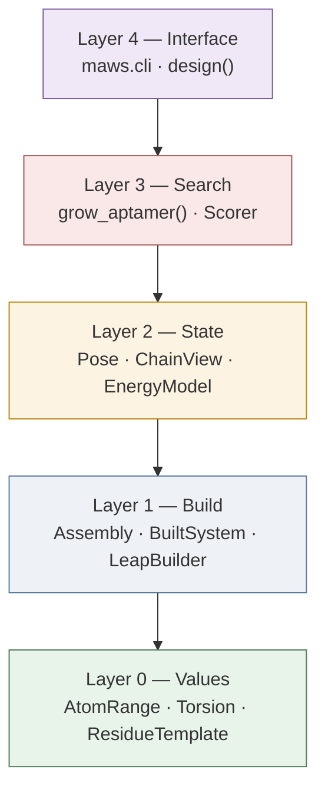

# MAWS API Redesign

**Start here:** read [01-values.md](01-values.md). It is the change everything else
depends on.

**Status:** built, on the branch `worktree-redesign-experimental`. These pages
are kept as the design they were written as, so the reasoning behind each
decision is still readable. Where the built code deviates from what a page
proposes, the page says so in a **Built as** note.

Two things happened that these pages did not anticipate, and both are worth
knowing before reading further:

- The old code is gone rather than deprecated. No compatibility shim was
  written, so `Complex`, `Chain`, `Structure`, `space` and `run` no longer
  exist and nothing imports them.
- An adversarial audit of the science ([PR #45]) landed while this was being
  built, and fixing what it found changed several decisions these pages had
  already made — including which score the search uses.
  [09-audit-response.md](09-audit-response.md) is the record of that.

[PR #45]: https://github.com/gc-os-ai/MAWS_2025/pull/45

---

## The problem in one table

People call this codebase "a spaghetti of classes and subclasses." That is not
quite right. There is almost no inheritance here. `Structure`, `Chain`, and
`Complex` are three plain classes. Nothing subclasses anything.

Three real problems make it hard to read:

| # | Problem | Where | Fixed by |
| --- | --- | --- | --- |
| R1 | One list `[start, bond, end]` means 5 different things | everywhere | [01-values.md](01-values.md) |
| R2 | `Chain` and `Complex` point at each other and edit each other | [chain.py:149](../../maws/chain.py#L149) | [03-pose.md](03-pose.md) |
| R3 | Edit history is stored in 6 loose fields, not a type | `*_history` fields | [03-pose.md](03-pose.md) |

Two more problems follow from those three:

| # | Problem | Cost | Fixed by |
| --- | --- | --- | --- |
| C1 | The search algorithm is written out twice | 480 duplicate lines | [05-search.md](05-search.md) |
| C2 | Nothing runs in tests without AmberTools installed | slow CI, no coverage | [04-energy.md](04-energy.md) |

---

## The layers

One idea: keep chemistry, coordinates, and search in separate layers. Right now
`Complex` does all three.



Each layer may only use layers below it. That rule gives you:

- Layer 0 imports nothing but `dataclasses` and `numpy`.
- Layer 1 is the only layer that reads or writes files.
- Layer 2 is the only layer that imports OpenMM.
- Layer 3 uses protocols, not concrete classes. So it runs in tests in
  milliseconds.

---

## Read in this order

| Doc | What it covers | Read time |
| --- | --- | --- |
| [00-principles.md](00-principles.md) | 6 rules the other docs follow | 8 min |
| [01-values.md](01-values.md) | `AtomRange`, `Torsion`, `ResidueTemplate`, `NucleotideSequence` | 12 min |
| [02-topology.md](02-topology.md) | `ForceField`, `Assembly`, `BuiltSystem`, `LeapBuilder` | 12 min |
| [03-pose.md](03-pose.md) | `Pose`, `ChainView`, `Edit` | 15 min |
| [04-energy.md](04-energy.md) | `EnergyModel` protocol, `StubEnergy` | 8 min |

Then:

| Doc | What it covers | Read time |
| --- | --- | --- |
| [05-search.md](05-search.md) | `grow_aptamer()` and typed events | 10 min |
| [06-cli.md](06-cli.md) | CLI and the Python API | 10 min |
| [07-migration.md](07-migration.md) | 10 PRs in order, with time estimates | 10 min |
| [08-patterns.md](08-patterns.md) | What the design is called; OpenMM/sklearn conventions | 10 min |
| [09-audit-response.md](09-audit-response.md) | The science defects the audit found, and what was done | 12 min |

---

## Before and after

The clearest summary is what a caller has to type.

### Now

```python
import copy
from openmm import unit
import maws.space as space
from maws.complex import Complex
from maws.rna_structure import load_rna_structure
from maws.routines import entropy_score

cpx = Complex(
    force_field_aptamer="leaprc.RNA.OL3",
    force_field_ligand="leaprc.protein.ff19SB",
    salt_conc=0.15,
)
cpx.add_chain("", load_rna_structure())
cpx.add_chain_from_pdb(                        # force fields passed again
    pdb_path="ligand.pdb",
    force_field_aptamer="leaprc.RNA.OL3",
    force_field_ligand="leaprc.protein.ff19SB",
    parameterized=True,
)

ligand_only = Complex(                         # a second Complex, just to get a centre
    force_field_aptamer="leaprc.RNA.OL3",
    force_field_ligand="leaprc.protein.ff19SB",
    salt_conc=0.15,
)
ligand_only.add_chain_from_pdb(
    pdb_path="ligand.pdb",
    force_field_aptamer="leaprc.RNA.OL3",
    force_field_ligand="leaprc.protein.ff19SB",
    parameterized=True,
)
ligand_only.build()

sampler = space.make_sampler(ligand_only, reach=10.0, probe=1.4)
rotations = space.NAngles(4)

cx = copy.deepcopy(cpx)                        # deepcopy of an object holding a Simulation
aptamer = cx.aptamer_chain()                   # chain 0 is the aptamer, by convention
aptamer.create_sequence("G")
cx.build()

positions0 = cx.positions[:]                   # save coordinates by hand
energies = []
for _ in range(5000):
    pose = sampler.generator()                 # not a generator; returns one sample
    cx.translate_global(aptamer.element, pose.position * unit.angstrom)
    cx.rotate_global(aptamer.element, pose.axis * unit.angstrom, pose.angle)
    for j in range(4):
        aptamer.rotate_in_residue(0, j, rotations.generator()[j])
    energies.append(cx.get_energy()[0])
    cx.positions = positions0[:]               # restore by hand, every loop

score = entropy_score(energies, beta=0.01)
```

### Proposed

```python
from itertools import islice
import numpy as np

from maws import Assembly, ForceField, build, free_energy_score, rna
from maws.sampling import SurfaceSampler, TorsionAngles

rng = np.random.default_rng(0)                       # one seed, whole run repeatable
ff = ForceField.for_target("RNA", "protein", salt_conc=0.15)
system = build(
    Assembly()
    .with_aptamer(rna(), sequence="G")
    .with_ligand("ligand.pdb", ff),
    ff,
)

aptamer  = system.chain("aptamer")
torsions = aptamer.residue(0).torsions()             # the bonds we may turn
sampler  = SurfaceSampler.around(system, "ligand", reach=10.0, probe=1.4, rng=rng)
angles   = TorsionAngles(len(torsions), rng=rng)
energy   = system.energy_model()
base     = system.pose                               # a value; never copied

energies = []
for placement in islice(sampler, 5000):              # the loop reads top to bottom
    pose = base.place(aptamer, placement)            # put the strand somewhere
    pose = pose.rotate_all(torsions, angles.sample())  # give it a shape
    energies.append(energy.evaluate(pose))           # score it

score = free_energy_score(energies, beta=0.01)
```

The loop is the point. It has the same shape as a PyTorch training loop — iterate a
source, transform, score, record — and each line is one named call rather than a
step buried inside a comprehension. `base` never changes, so "start again from the
beginning" is just using the variable again.

Fewer lines is not the goal. Fewer things to know is. Gone: `deepcopy`, the second
`Complex`, manual save/restore, force fields typed twice, `* unit.angstrom` at call
sites, chain-by-index, and the global RNG that made runs unrepeatable.

---

## Not changing

This was the plan. Three of the four did not survive contact with the audit.

- **The science.** ~~Bondi radii, SAS rejection, the entropy score, GB salt
  screening, and the grow-by-one-nucleotide strategy stay exactly as they
  are.~~
  **Built as:** Bondi radii, GB salt screening and grow-by-one-nucleotide are
  unchanged. The SAS rejection now tests the strand's atoms rather than one
  point, and the entropy score is no longer the default — it preferred
  candidates that mostly clash. See
  [09-audit-response.md](09-audit-response.md).
- **`pdb_cleaner.py`** ~~(655 lines). Already clean and tested. It only
  moves.~~
  **Built as:** rewritten. It was neither clean nor tested: it sorted the file
  and never undid the sort, deleted residues out of the middle of chains, and
  threw away everything after the last `TER`. See
  [09-audit-response.md](09-audit-response.md).
- **`prepare.make_lib`.** Same behaviour, plus a caller-supplied residue name
  — and a net charge, which `antechamber` was never given.
- **The `.maws_cache/` format.** Same SHA1-keyed `.prmtop`/`.inpcrd` pairs,
  keyed on the contents rather than the name.

---

## The 3 questions, answered

1. **Is `rotate_in_residue` applying each torsion 3 times on purpose?** No, it
   was a bug. It is gone with the code that held it, and
   `Pose.rotate_all` applies each turn exactly once — checked by turning every
   bond of a real strand and measuring every bond length.
2. **Delete `Complex.rigid_minimize`?** Deleted, along with `Complex`. Settling
   is now `maws.relax.perturb_and_minimize`, which takes the atoms that may
   move so the target stays where it is.
3. **Does anything outside this repo import `maws.complex.Complex`?** Treated
   as no. There is no shim; the branch is a clean break.

**Next:** open [01-values.md](01-values.md).
</content>
