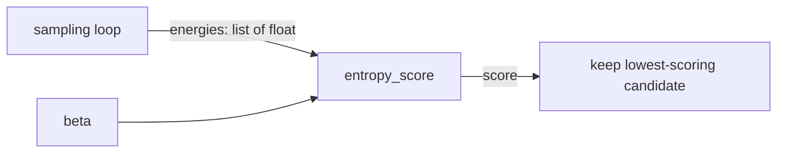

# Scoring API Reference

`maws.scoring` provides the scoring function that drives nucleotide selection in the MAWS aptamer-design loop.

## Where this criterion comes from

The score is not an invention of this package. It implements the **Entropic Fragment-Based Approach (EFBA)** of Tseng et al. (2011), *Chemical Biology & Drug Design* 78(1), 1–13, also US patent 8,484,010 B2 — the method the original MAWS was built on (Kalinowski et al., iGEM Heidelberg 2016). The formula below is the one those authors published, and MAWS reproduces it faithfully.

That matters when you read the rest of this page. Several properties of the score look like defects. They are the published method's design choices. Each one is flagged where it appears.

## Overview

Each step of the MAWS search samples many conformations of a candidate aptamer against the ligand and records their potential energies. `maws.scoring` turns that energy sample into a single number. The one public entry point is [`entropy_score`](#entropy_score); MAWS keeps the candidate whose score is **lowest**.

### How `scoring` connects to the rest of MAWS

`entropy_score` is the single seam between this module and everything else. Both the CLI script (`maws.maws2023.main`) and the programmatic API class (`maws.run.MawsRunner.run`) call it once per candidate nucleotide, per search step, on the list of energies gathered in that step's sampling loop.



---

## `entropy_score`

```python
entropy_score(sample, beta=0.01) -> float
```

| Parameter | Type | Default | Description |
|---|---|---|---|
| `sample` | array-like of `float` | *required* | Energy values (kJ/mol) from conformational sampling |
| `beta` | `float` | `0.01` | How sharply lower energies are favoured, in mol/kJ. A Lagrange multiplier, not a temperature — see [Choosing `beta`](#choosing-beta) |

Returns a `float`. Raises `ValueError` if `sample` is empty — there is no distribution to score, so no return value would be meaningful.

The energies are converted to a Boltzmann distribution `P(i) = exp(-beta * E_i) / Z`, and the score is

```
-sum(P * log(P * N))
```

which is the negative Kullback–Leibler divergence of that distribution from the uniform distribution over the `N` samples.

### Interpreting the score

Read the probabilities as a preference. Weighting each conformation by `exp(-beta * E)` makes low-energy conformations likely and high-energy ones unlikely, and the weights across all `N` conformations add up to 1. Spread evenly, the strand favours no particular way of sitting against the ligand. Piled onto a few conformations, it favours those few.

The score reports how far the weights sit from evenly spread. Evenly spread scores `0`, the maximum. The more the weight piles onto a few conformations, the further below `0` the score falls, down to a floor of `-log(N)`.

EFBA takes a strong preference as its evidence of a good binder, on the reasoning that a strand which fits the ligand settles into a small number of conformations. That is why MAWS selects by minimum.

Two consequences worth knowing:

- **It is shift-invariant.** Adding a constant to every energy leaves the score unchanged. Only the *spread* of the energies matters. So the score cannot distinguish a candidate whose conformations all sit at `-5000 kJ/mol` from one whose conformations all sit at `+5000 kJ/mol`. This is inherent to the method. EFBA builds its Boltzmann distribution from a total energy in which such constants cancel by construction. The score therefore measures how tightly a candidate settles, and binding strength needs a separate term.

  `MawsResult.energy` is not a binding energy either. It is the lowest total potential energy of the whole complex over the sampled poses. No unbound reference is subtracted, so the target's own internal energy dominates it. Candidates with different atom counts do not produce comparable values. Nothing in the search branches on it. See issue #49 (C4).
- **It depends on `N`.** Because the reference is the uniform distribution over exactly the sampled points, scores are only comparable between candidates evaluated with the same sample count. MAWS satisfies this by drawing a fixed number of samples per search step (the chunk size).

### Choosing `beta`

`beta` sets how sharply energy differences are weighted. As `beta → 0` all conformations weigh equally and the score flattens toward `0` for every candidate, losing discrimination; as `beta` grows the score is dominated by the single lowest-energy conformation. It is exposed as `MawsRunner(beta=...)` and `--beta` on the CLI.

**The default of `0.01` is a Lagrange multiplier, not a temperature.** In EFBA it is the multiplier of the maximum-entropy derivation, and `0.01` is the value those authors used. They report their nucleotide ranking held across every multiplier they tried. Read instead as a physical `1/RT`, `0.01` means roughly 12,000 K. That is why it differs from the `0.401 mol/kJ` of a 300 K calculation. Changing it to `0.401` departs from the published method rather than correcting it.

### Usage

```python
from maws.scoring import entropy_score

energies = [-1500.0, -1490.0, -1450.0, -1200.0]
score = entropy_score(energies, beta=0.01)
```

Inside the search loop, the pattern is:

```python
best_score = None
for ntide in nucleotides:
    energies = [sample_one_pose() for _ in range(chunk_size)]
    score = entropy_score(energies, beta=self.beta)
    if best_score is None or score < best_score:
        best_score = score
        best_sequence = ntide
```

---

## Numerical notes

Weights are computed in log-space with `scipy.special.logsumexp`, and the score itself with `scipy.stats.entropy`. This matters because OpenMM energies for clashing poses routinely reach 1e5–1e6 kJ/mol: at `beta=0.01` the corresponding weights are around `exp(-1e4)`, which flushes to zero in double precision if exponentiated directly, while strongly negative energies overflow `Z` to infinity in the other direction. Shifting by the maximum log-weight removes both failure modes.

Conformations whose weights still underflow after the shift carry probability on the order of `exp(-1e4)`. They contribute nothing to the sum. That is a problem rather than a convenience.

**A sample containing hard clashes scores as though it had been sampled fewer times.** A clash near `1e8 kJ/mol` has a Boltzmann weight of exactly zero in double precision, so it leaves the distribution. Suppose `m` of `N` conformations survive with comparable energies. The score then approaches `log(m) - log(N) = log(m/N)`. More clashes means a *lower* score, and MAWS selects the lowest. A candidate that clashes most of the time can beat one that never clashes.

The fix is to keep clashes out of the sample. `maws.space.draw_clear_conformation` does this for the first nucleotide, and `maws.space.draw_clear_torsions` for every one after it. Both reject and redraw any conformation whose atoms overlap the target. See issue #49 (C1).

> **Note (2026): implementation change.** This module previously used `mpmath` at 60 decimal digits of precision to avoid the same underflow. Arbitrary precision was never the right tool — the log-sum-exp shift addresses the problem directly in double precision, and is ~250× faster. Scores from the two implementations agree to within 2e-15 absolute across energy ranges from 1e0 to 1e6 kJ/mol and `beta` from 0.001 to 0.1, so results are unchanged. `mpmath` is no longer a dependency.

## Internal helpers

`_boltzmann(sample, beta)` returns `(P, log_z)`: the normalised probability array and the natural log of the partition function. It is private and may change without notice. It returns **log** `Z` rather than `Z` because `Z` itself overflows double precision for strongly negative energies. The log is always finite.
