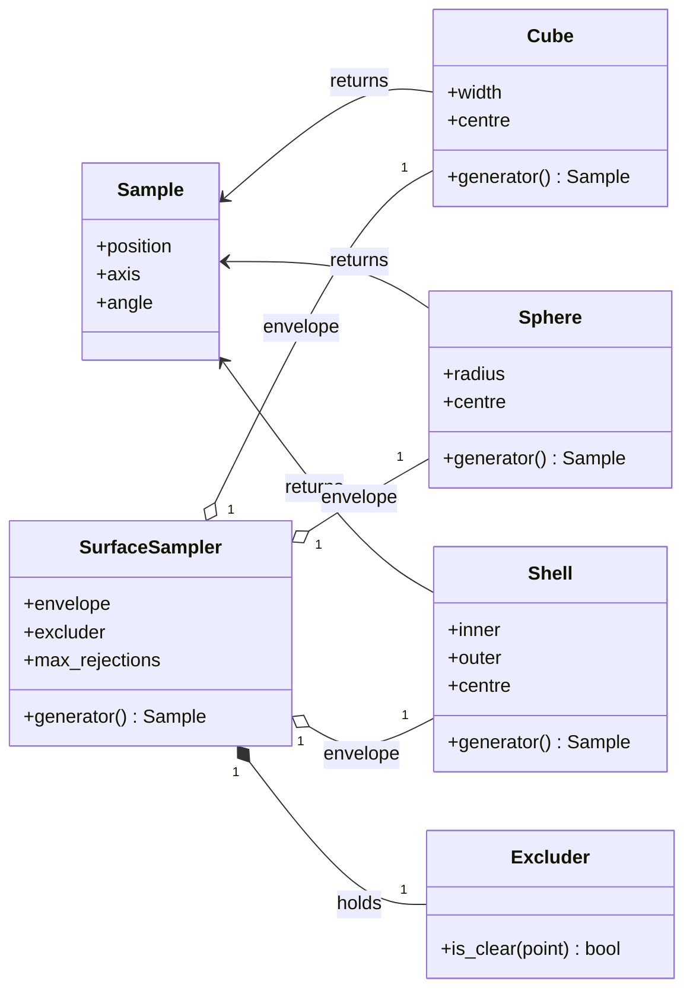

# Space API Reference

`maws.space` — surface-aware sampling region for the MAWS aptamer-design loop.

## Overview

`maws.space` builds the geometric region from which MAWS draws candidate poses for the initial nucleotide. Samples are drawn from a user-chosen envelope (cube / sphere / shell) auto-sized to the ligand, and rejected if they fall inside the ligand bulk via a Bondi-vdW + SAS-probe check.

The intended public entry point is the [`make_sampler`](#make_sampler) factory. It picks the envelope shape, sizes it from the ligand atoms, and wraps everything in a [`SurfaceSampler`](#surfacesampler) whose `.generator()` returns a [`Sample`](#sample) you pass to `Complex.translate_global` / `rotate_global`.



## `make_sampler`

```python
make_sampler(
    shape: str,                    # "cube" | "sphere" | "shell"
    complex_obj: Complex,          # built ligand-only Complex
    *,
    reach: float = 10.0,           # Å beyond surface
    probe: float = 1.4,            # Å, vdW probe (water-like)
) -> SurfaceSampler
```

The factory. Auto-sizes the envelope from `complex_obj.positions` + `complex_obj.topology.atoms()` and returns a ready-to-use `SurfaceSampler`. Raises `ValueError` for an unknown `shape`.

```python
import maws.space as space

sampler = space.make_sampler("shell", ligand_only_complex)
pose = sampler.generator()
print(pose.position, pose.axis, pose.angle)
```

## `Sample`

```python
@dataclass(frozen=True)
class Sample:
    position: np.ndarray  # shape (3,), Å
    axis: np.ndarray      # shape (3,), unit vector
    angle: float          # radians
```

What every envelope and sampler returns from `.generator()`. Replaces the old 7-element ndarray with positional indexing.

## Envelope dataclasses

All three are `@dataclass(frozen=True)` with `.generator() -> Sample`. Their dimensions are normally computed by [`compute_envelope_dims`](#compute_envelope_dims) — call them directly only if you know what radii you want.

### `Cube`

| Attribute | Type | Description |
|-----------|------|-------------|
| `width` | `float` | Side length, Å |
| `centre` | `np.ndarray` | 3D centre coordinate |

Uniform sampling over the axis-aligned cube. Random rotation axis (unit) and angle in `[0, π]`.

### `Sphere`

| Attribute | Type | Description |
|-----------|------|-------------|
| `radius` | `float` | Sphere radius, Å |
| `centre` | `np.ndarray` | 3D centre coordinate |

Uniform-in-volume radial sampling (`r = R · u^(1/3)`), uniform direction on the sphere (`cos(ψ)` ∈ `[-1, 1]`). Rotation axis (unit) and angle in `[0, 2π]`.

### `Shell`

| Attribute | Type | Description |
|-----------|------|-------------|
| `inner` | `float` | Inner radius, Å |
| `outer` | `float` | Outer radius, Å |
| `centre` | `np.ndarray` | 3D centre coordinate |

Volume-correct shell sampling (`r = (u·(R_out³ − R_in³) + R_in³)^(1/3)`), uniform direction. The default shape used by `make_sampler` — for non-globular ligands it hugs the surface much more tightly than a `Sphere`.

## `Excluder`

```python
class Excluder:
    def __init__(self, complex_obj, probe: float = 1.4): ...
    def is_clear(self, point: np.ndarray) -> bool: ...
```

KDTree-backed (scipy.spatial.KDTree) SAS-style rejection: `is_clear(point)` is `True` iff `point` lies outside `(vdW + probe)` of every atom in `complex_obj.topology`. vdW radii come from a built-in Bondi table; unknown elements fall back to a carbon-equivalent default (`1.70 Å`) and emit a `RuntimeWarning` once per process per unknown symbol.

| Method | Description |
|--------|-------------|
| `is_clear(point)` | True iff `point` is outside every (vdW + probe) sphere |

## `SurfaceSampler`

```python
@dataclass
class SurfaceSampler:
    envelope: Envelope
    excluder: Excluder
    max_rejections: int = 1000
    def generator(self) -> Sample: ...
```

Composes one envelope + one excluder into a rejection sampler. `.generator()` draws from the envelope until the excluder accepts; raises `SamplingError` after `max_rejections` attempts if the envelope is fully buried.

## `compute_envelope_dims`

```python
compute_envelope_dims(complex_obj, shape: str, reach: float) -> dict
```

Returns the kwargs for the matching envelope dataclass. Useful in tests / notebooks. Internally:

- Mass-weighted COM of the ligand (`maws.helpers.mass_weighted_center`).
- `R_max` = farthest atom from COM; `R_min` = closest.
- Per-shape formulas:

| Shape | Returned dims |
|-------|---------------|
| `cube` | `{"width": 2·(R_max + reach), "centre": COM}` |
| `sphere` | `{"radius": R_max + reach, "centre": COM}` |
| `shell` | `{"inner": max(0, R_min − 5), "outer": R_max + reach, "centre": COM}` |

## `NAngles`

```python
@dataclass(frozen=True)
class NAngles:
    n: int
    def generator(self) -> np.ndarray: ...
```

`N` independent angles in `[0, 2π)`. Used for in-residue backbone torsion rotations alongside the surface sampler.

## `SamplingError`

`RuntimeError` subclass. Raised by `SurfaceSampler.generator()` when no clear point can be drawn within `max_rejections` attempts — typically a misconfigured envelope (too small `reach`, too large `probe`, or ligand fully filling the bounding box).

## CLI / `MawsRunner` integration

The same parameters are exposed through both interfaces, with identical defaults:

| Flag (CLI) | Kwarg (`MawsRunner`) | Default | Meaning |
|-----------|----------------------|---------|---------|
| `--shape {cube,sphere,shell}` | `shape="shell"` | `"shell"` | Envelope geometry |
| `--reach FLOAT` | `reach=10.0` | `10.0` | Å beyond surface |
| `--probe FLOAT` | `probe=1.4` | `1.4` | vdW probe (Å, water-like) |

See [docs/run.md](run.md) for the runner-level table.

## Tuning notes

- **Defaults are right for most targets.** Tweak only if rejection rates are extreme or if you hit a `SamplingError`.
- **`reach`** is the *outer* boundary — too small starves the sampler, too large wastes compute on solvent. Default `10 Å` ≈ one nucleotide of slack.
- **`probe`** is the *inner* boundary — `1.4 Å` is the water-equivalent SAS probe used by Chimera, PyMOL, FreeSASA. Larger → conservative (only big pockets accessible); smaller → permissive.

For a visual walkthrough on a real PDB see [`notebooks/maws/space_analysis.ipynb`](../notebooks/maws/space_analysis.ipynb).
