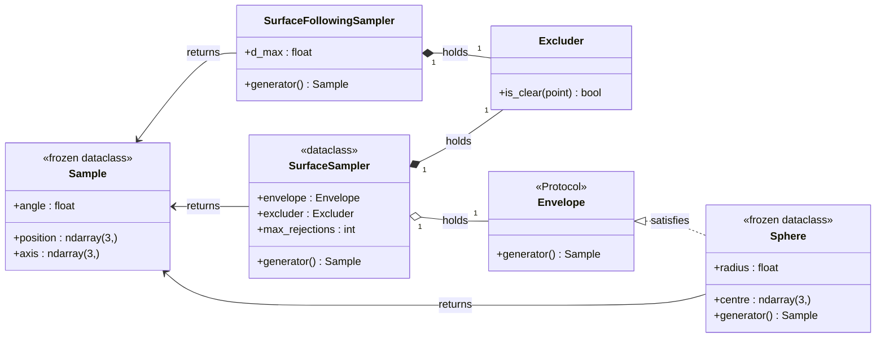
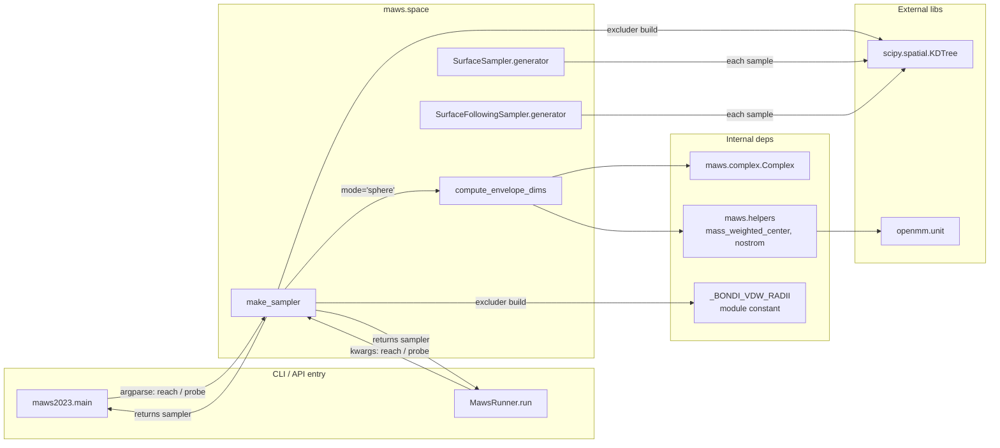

# Space API Reference

`maws.space` provides the surface-aware sampling region for the MAWS aptamer-design loop.

## Overview

`maws.space` builds the geometric region from which MAWS draws candidate poses for the initial nucleotide. The single public entry point is [`make_sampler`](#make_sampler). It builds the requested sampler from a ligand-only `Complex` and returns an object whose `.generator()` yields candidate [`Sample`](#sample) values that pass the configured filters.

Two sampling modes are available:

| mode | what it does | when to pick it |
|---|---|---|
| `"sphere"` (default) | Bounding sphere envelope around the ligand COM, with an SAS-style rejection that skips candidates inside the protein bulk. | Default for most use cases. Fast (~40% rejection rate). Returns a [`SurfaceSampler`](#surfacesampler). |
| `"surface-following"` (opt-in) | Same SAS rejection plus an outer cap that rejects candidates more than `d_max` Å from any protein atom. Accepted samples concentrate near the molecular surface. | Use when you need more samples close to the surface and can afford a higher rejection rate (~85%). Returns a [`SurfaceFollowingSampler`](#surfacefollowingsampler). |

> **Note on prior shapes.** This module previously offered `Cube` and `Shell` envelopes. Both were measured on real targets (`notebooks/space_analysis.ipynb` on 1HAO) and dropped: `Cube` wasted its corners; `Shell`'s formula `inner = max(0, R_min - 5)` collapsed to 0 for every real protein, so it was just a sphere. The opt-in `surface-following` mode is the principled successor to the `Shell` idea.

### Class structure

`Sample` is the only value type. `Sphere` satisfies the structural `Envelope` Protocol (anything with `.generator() -> Sample` qualifies, so you can pass a custom envelope directly to `SurfaceSampler` if you want a non-spherical region).



### How `space` connects to the rest of MAWS

`make_sampler` is the single seam between this module and everything else. Both the CLI script (`maws.maws2023.main`) and the programmatic API class (`maws.run.MawsRunner.run`) construct exactly **one** sampler per run via `make_sampler`, then call `.generator()` repeatedly inside the per-nucleotide sampling loop.



## `make_sampler`

```python
make_sampler(
    complex_obj,                       # built ligand-only Complex
    *,
    mode: Literal["sphere", "surface-following"] = "sphere",
    reach: float = 10.0,               # mode="sphere" only
    d_max: float = 6.0,                # mode="surface-following" only
    probe: float = 1.4,                # both modes
)
```

The factory. Picks the requested sampler, auto-sizes from `complex_obj.positions` + `complex_obj.topology.atoms()`, builds an `Excluder`, and returns a ready-to-use object. Raises `ValueError` on unknown `mode`, negative `reach`/`probe`, or non-positive `d_max`.

```python
import maws.space as space

# Default sphere mode (most callers want this).
sampler = space.make_sampler(ligand_only_complex)
pose = sampler.generator()
print(pose.position, pose.axis, pose.angle)

# Opt-in surface-following with a 4 Å band.
sampler = space.make_sampler(
    ligand_only_complex, mode="surface-following", d_max=4.0
)
pose = sampler.generator()
```

## `Sample`

```python
@dataclass(frozen=True)
class Sample:
    position: np.ndarray  # shape (3,), Å
    axis: np.ndarray      # shape (3,), unit vector
    angle: float          # radians
```

What every sampler returns from `.generator()`.

## Envelopes

### `Sphere`

```python
@dataclass(frozen=True)
class Sphere:
    radius: float
    centre: np.ndarray
```

`.generator() -> Sample` draws uniformly **in volume** over the sphere:

- Radial: `r = radius * u^(1/3)` for `u ~ U(0, 1)` (cube-root is the inverse of the volume CDF; otherwise samples concentrate at the centre).
- Direction: `cos(psi) ~ U(-1, 1)` and `phi ~ U(0, 2pi)`, giving a uniform point on the unit sphere (a naive `psi ~ U(0, pi)` would over-sample the poles).
- `position = centre + r * direction`; `axis` independent random unit vector; `angle ~ U(0, 2pi)`.

### `Envelope` (Protocol)

```python
class Envelope(Protocol):
    def generator(self) -> Sample: ...
```

Structural typing for "anything with `.generator() -> Sample`". Pass a custom envelope to `SurfaceSampler` directly if you want a different geometric region.

## `Excluder`

```python
class Excluder:
    def __init__(self, complex_obj, probe: float = 1.4): ...
    def is_clear(self, point: np.ndarray) -> bool: ...
```

KDTree-backed SAS rejection: `is_clear(point)` is `True` iff `point` lies outside `(vdW + probe)` of every protein atom. vdW radii come from a built-in Bondi table; unknown elements fall back to a carbon-equivalent default (`1.70 A`) and emit a `RuntimeWarning` once per process per unknown symbol.

## `SurfaceSampler`

```python
@dataclass
class SurfaceSampler:
    envelope: Envelope
    excluder: Excluder
    max_rejections: int = 1000
    def generator(self) -> Sample: ...
```

Composes one envelope + one excluder into a rejection sampler. `.generator()` draws from the envelope until the excluder accepts; raises `SamplingError` after `max_rejections` attempts if the envelope is fully buried.

## `SurfaceFollowingSampler`

```python
class SurfaceFollowingSampler:
    def __init__(self, complex_obj, *, d_max=6.0, probe=1.4, max_rejections=50_000): ...
    def generator(self) -> Sample: ...
```

Alternative sampler that draws candidates uniformly in the band

```
{ p : p is SAS-clear AND dist(p, nearest_protein_atom) <= d_max }
```

i.e. a layer of thickness `d_max` wrapping the protein's atomic surface, capped on the outside to avoid sampling far solvent. Each `.generator()` call:

1. Draws a uniform-in-volume point in the bounding sphere of radius `R_max + d_max` around the mass-weighted COM.
2. Queries a KDTree of protein atom positions for the nearest atom distance. Rejects if greater than `d_max`.
3. Runs an `Excluder` SAS check. Rejects if inside protein bulk.
4. Repeats until both filters pass, or `max_rejections` attempts have failed (raises `SamplingError`).

Rejection rate is higher than `SurfaceSampler`'s (~85% vs ~40% on a typical protein), so per-accepted-sample cost is higher. In exchange, accepted samples concentrate near the surface. Benchmarks on `notebooks/space_analysis.ipynb` showed ~1.4 to 1.9x more accepted samples within 5 A of the binding region across two thrombin variants.

## `compute_envelope_dims`

```python
compute_envelope_dims(complex_obj, reach: float) -> dict
```

Returns `{"radius": R_max + reach, "centre": COM}`, the kwargs for `Sphere`. Used internally by `make_sampler` when `mode="sphere"`; useful in tests / notebooks for inspecting the dimensions without building the full sampler.

## `SamplingError`

`RuntimeError` subclass. Raised when either sampler cannot find a clear point within `max_rejections` attempts. Typical causes:

- For `mode="sphere"`: the envelope is mis-sized (very small `reach`, very large `probe`).
- For `mode="surface-following"`: `d_max` is too small relative to the protein's surface roughness, or the protein is unusually dense.

## CLI / `MawsRunner` integration

The same parameters are exposed through both interfaces, with identical defaults:

| Flag (CLI)              | Kwarg (`MawsRunner`) | Default | Meaning |
|-------------------------|----------------------|---------|---------|
| `--reach FLOAT`         | `reach=10.0`         | `10.0`  | A beyond `R_max` (sphere mode) |
| `--probe FLOAT`         | `probe=1.4`          | `1.4`   | vdW probe (A, water-like) |

The `mode` and `d_max` parameters are currently library-only (not surfaced through `MawsRunner` or the CLI). To benchmark them on a different target, call `space.make_sampler` directly from a notebook.

See [docs/run.md](run.md) for the runner-level table.

## Tuning notes

- **Defaults are right for most targets.** Tweak only if rejection rates are extreme or if you hit a `SamplingError`.
- **`reach`** (sphere mode): too small starves the sampler, too large wastes compute on solvent. Default `10 A` is roughly one nucleotide of slack.
- **`d_max`** (surface-following mode): smaller values concentrate samples tighter to the surface but raise rejection rate further. The notebook benchmark found `d_max=4` was the best tradeoff on the targets tested.
- **`probe`**: `1.4 A` is the water-equivalent SAS probe used by Chimera, PyMOL, FreeSASA. Larger means conservative (only big pockets accessible); smaller means permissive.

For a step-by-step walkthrough including a comparison of both modes on real thrombin-aptamer structures (1HAO + 3DD2), see [`notebooks/space_analysis.ipynb`](../notebooks/space_analysis.ipynb).
